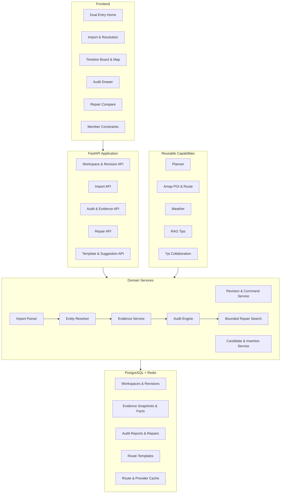

# BreezeTravel 双入口可验证行程产品与架构重构最终方案

> 版本：Final 2.0  
> 日期：2026-08-21  
> 状态：领域约束、持续验收与自动优化的唯一权威开发基线  
> 适用仓库：`D:\munto\code\claudeProject\agentTravel`  
> 适用范围：北京、上海、杭州；2～5 人；2～5 天国内城市自由行  
> 事实边界：本文定义目标状态、实施顺序和验收门禁，不代表目标能力已经实现或通过验收

## 0. 文档效力与使用方式

本文融合并取代以下两份草案，并在 Final 2.0 中补齐持续验收、真实 Provider 闭环、模型评测隔离、路线构建反馈账本和互联网来源治理：

- `archive/plans/BreezeTravel_统一产品与架构重构方案_2026-08-20.md`；
- `archive/plans/BreezeTravel_双入口可验证行程产品与重构实施方案_v3.md`。

后续产品、架构、接口、数据模型和开发排期以本文为准。若实现与本文冲突，应先更新本文或新增 ADR，再修改代码。

本文不再只描述“应当建设什么”，还必须回答以下可执行问题：

1. 使用哪一份机器可读 `RunSpec` 运行；
2. 输入、模型、Prompt、Provider、代码和配置如何冻结；
3. 真实产品链路实际执行到哪一步；
4. 哪些指标由确定性事实判定，哪些指标允许 LLM-as-Judge 判定；
5. Candidate 相对 Baseline 是否达到晋级阈值；
6. 失败样本进入哪个回归集，如何避免污染 blind；
7. 发布证据是否属于同一 commit、配置、数据和运行时间。

文中约束词含义：

- **必须**：对应阶段完成前必须实现，未满足不能宣称该阶段完成；
- **应当**：默认实现方式，如需偏离必须记录 ADR、原因和替代门禁；
- **不得**：当前阶段明确禁止；
- **以后再做**：不进入当前排期，只有前置证据支持时才能启动。

所有进度和发布说明必须使用以下证据状态，不得跨级推断：

```text
planned
implemented
unit_verified
integration_verified
snapshot_verified
live_provider_verified
publicly_verified
user_validated
```

文档完成、代码存在、本地测试、快照回放、真实 Provider、公网可用和真人验证是不同证据层级，任何一层都不能代替另一层。

`GPT-5.6-sol` 生成的行程统一标记为 `high_fidelity_synthetic`；子 Agent 或模型评审统一标记为 `automated_proxy_judge`。二者均不得写成真实用户、真实组织者、真人校准或真人发布证据。

---

## 1. 最终产品决策

### 1.1 产品定位

BreezeTravel 不再把“自动生成一份完整旅行攻略”作为主产品，也不只做一个导入后罗列警告的检查器。

下一阶段统一定位为：

> **面向小团体的可验证行程工作台：用户可以导入已有 AI/手工行程，也可以从城市路线骨架开始组合；系统持续检查地点、时间、交通、营业、天气和成员约束，并提供有证据、可预览、可撤销、修复后重新验证的最小修改方案。**

面向用户的首屏表达：

> **把 AI 攻略或旅行想法，变成真的能走、适合同行人、每次修改都有依据的行程。**

技术定位：

> **Evidence-backed Collaborative Itinerary Verifier & Repair Engine**

### 1.2 双入口、单核心

| 用户状态 | 产品入口 | 入口目标 |
|---|---|---|
| 已有 AI、攻略或手工行程 | 导入 → 消歧 → 排雷 → 修复 | 尽量保留原计划，只局部修复真实问题 |
| 还没有完整行程 | 城市骨架 → 选点 → 编辑 → 持续检查 | 降低从零规划成本，避免先生成不可执行方案 |

两个入口只负责产生标准行程草稿，形成 `ItineraryRevision` 后完全汇合，共享：

```text
实体对齐
→ 证据快照
→ Audit Engine
→ Repair Option
→ 新 Revision
→ 完整复验
→ 成员确认
```

不得为导入检查和模板规划维护两套行程、规则、报告或修复模型。

### 1.3 开发顺序

固定顺序修正为：

```text
M1-foundation：真实导入事实闭环
版本底座 → 导入与消歧 → 候选来源/坐标持久化 → Evidence Collector → Audit Engine → 最小修复

M2-eval：持续验收闭环
RunSpec → 5.6-sol 高拟真输入 → 真实 HTTP 产品执行 → DeepSeek 结构化修复 → 独立 Judge → Baseline/Candidate 晋级

M3-builder：单线式路线构建
起点搜索 → SuggestionSet → 下一站排序 → 原子接受 → 反馈事件 → 拖拽/Undo → 增量审计

M4-beta：成员协同与受控发布
成员约束 → 分享确认 → 冲突处理 → 临行复检 → 真实用户校准 → 公网验证
```

现有一次性代理校准不再作为后续开发的唯一前置条件。M1-foundation 和 M2-eval 必须先完成，因为没有事实连续性和版本化实验账本时，扩大样本或调 Prompt 不会产生可复现的质量提升。真实组织者校准不阻断本地开发，但必须在任何“受控三城 Beta 已验证”或公网可用性表述前完成；代理校准永远不得写成真人证据。

### 1.4 北极星结果

核心结果不是“生成了多少地点”或“用了多少 Agent”，而是：

> **用户用更短时间得到一份已经确认关键风险、满足成员硬约束、可以实际执行的行程版本。**

核心指标：

- `time_to_first_confirmed_itinerary`；
- `accepted_high_risk_findings_per_audit`；
- `hard_constraint_miss_rate`；
- `repair_adoption_rate`；
- `report_share_or_reuse_rate`。

“发现至少一个问题的行程比例”不得单独作为成功指标，否则会激励系统制造警告。

---

## 2. 来源与取舍矩阵

| 决策主题 | 统一版优势 | v3 优势 | 最终裁决 |
|---|---|---|---|
| 产品表达 | 明确从生成器转向审计与修复 | 双入口工作台表达更完整 | 采用双入口工作台，保留“可验证、最小修复”主线 |
| 开发顺序 | 审计产品先过真人门禁，再做拖拽 | R0～R6 动作更连续 | 先修复真实导入/Evidence 连续性，再建设 Continuous Runner，之后建设单线式 Route Builder，真人门禁保留到受控发布前 |
| 聚合模型 | 强调唯一权威 revision | `TripWorkspace` 能统一当前版本和状态 | 以 `TripWorkspace` 为聚合根，以 `ItineraryRevision` 为权威行程 |
| 版本与失效 | 哈希覆盖范围和 append-only 更严格 | 编辑命令和冲突响应更具体 | 合并为服务端 canonical hash、命令日志、If-Match 和幂等键 |
| 数据库迁移 | legacy 与新 Audit 表隔离更安全 | 009/010/011 分批更易回滚 | 分三次迁移，但新建 `audit_reports`，不改变旧表语义 |
| Audit | 规则分层与证据边界清楚 | 增量依赖和生命周期更具体 | 单一 Audit Engine，同时支持完整和增量审计 |
| Evidence | `UNAVAILABLE/CONFLICTING` 表达更准确 | Snapshot 生命周期描述更完整 | 使用四态 freshness，并保留 Snapshot 版本与来源 |
| Repair | 词典序和不静默覆盖更严格 | A/B、候选源和 postcheck 更具体 | 有界局部搜索、最多两个方案、强制 postcheck |
| 模板与候选 | 明确拖拽不是护城河 | insertion cost、四级候选、酒店评分完整 | 模板降为可选先验；默认从真实 Seed 开始，以 SuggestionSet 连续推荐成线 |
| 协同 | 服务端 revision 是事实源 | Yjs 共享结构和移动端操作具体 | Yjs 同步意图与引用，PostgreSQL 保存权威状态 |
| 完成定义 | R1/R2/R3 分阶段更诚实 | 最终双入口 E2E 更完整 | 定义 foundation/eval/builder/beta 四个里程碑，并由 G0～G6 可执行门禁决定状态 |

以上裁决是最终决策，不再保留并行命名或二选一实现。

---

## 3. 首期范围、非目标和不变量

### 3.1 首期范围

- 城市：北京、上海、杭州；
- 行程长度：2～5 天；
- 人数：2～5 人；
- 用户：20～40 岁、为朋友/情侣/亲子/带父母出行组织行程的人；
- 输入：纯文本行程、真实地点 Seed、可选系统路线骨架和用户手动选择；
- POI：景点、餐馆、酒店、交通节点；
- 设备：桌面端支持拖拽，移动端必须有按钮式等价操作；
- 证据：用户提供事实、官方来源、高德 POI/路线、天气和项目已审核资料；
- 审计：只运行能够说明输入、来源和判定边界的规则。

### 3.2 首期非目标

- 更多城市或任意国家/地区；
- 任意截图、视频、复杂 PDF、Word、Excel 导入；
- 大规模抓取小红书、抖音或所有景区网站；
- 实时排队、精确客流、全平台最低价或自动代订；
- 医疗安全结论和完整无障碍保证；
- 自动获取所有临时闭馆、节假日和预约政策；
- 实时后台监控和主动重规划；
- 通用 B2B Verifier API/SDK；
- GraphRAG、MQ、Kubernetes、微服务拆分或更多 Agent；
- 新一轮 LoRA 微调；
- 用 LLM Judge 代替真人事实标注。

### 3.3 系统不变量

1. `UNKNOWN` 永远不能自动转成 `SATISFIED`；
2. 验证状态和风险等级相互独立，`UNKNOWN` 可以是 `HIGH`；
3. 锁定项、固定预约、酒店、返程和成员 HARD 约束不得被静默删除或移动；
4. 每次编辑、修复和确认都创建新 revision，不就地覆盖；
5. 行程、消歧、成员约束、证据或规则变化后，旧报告必须失效；
6. 修复必须先预览，应用后必须运行完整审计；
7. 低置信度 POI 不得自动接受；
8. 高风险 finding 必须回读 reason code、输入值、证据、观测时间和受影响成员；
9. PostgreSQL 是权威事实源；localStorage、Yjs 和 LLM 输出不能单独决定事实；
10. 拖动一个地点不得触发完整 Planner 或 LLM 调用；
11. 导入、批量规划和增量编辑共享同一行程契约；
12. 同一规则只能有一个权威实现；
13. 任何外部数据失败都必须显式降级，不能用模型常识补齐；
14. 本地测试不能推断公网、真人或商业结果；
15. 5.6-sol 生成样本和自动 Judge 不得标记为真人；
16. 正式评测必须绑定 RunSpec、Baseline、当前代码/配置和数据 hash；
17. Blind 期望答案不得暴露给 Generator、被测系统或 Judge；
18. 候选接受必须从冻结 SuggestionSet 读取 canonical POI，客户端不能提交权威地点事实。

---

## 4. 当前实现基线与差距

以下基线基于 2026-08-21 当前工作区。代码、迁移、测试和一次性 evidence 已明显超过原 Final 1.0 的描述，因此本节以当前实现重新校正；任何 `implemented` 仍不自动升级为 `live_provider_verified`、`publicly_verified` 或 `user_validated`。

| 能力 | 当前可复用资产 | 仍阻断持续优化的关键差距 |
|---|---|---|
| Workspace/Revision | PostgreSQL revision、If-Match、幂等、Undo、resume、审计引用已存在 | 尚未把每次评测运行与当前 commit/config/dataset 绑定 |
| 导入 | 文本 parser、原文 span、实体候选、消歧、apply API 已存在 | `deterministic-cn-v1` 覆盖有限；apply 后没有完整物化已选候选、坐标和 Provider receipt |
| Evidence/Audit | 不可变 EvidenceSnapshot、三态 Audit、freshness、报告持久化已存在 | 普通 Audit 不会自动为初始 revision 完整采集相邻路线、天气和官方政策；导入后的事实连续性断裂 |
| Repair | preview/apply/postcheck、锁定保护、重复地点和时间链修复已存在 | 搜索空间不足，尚不能稳定执行 Provider-backed replace/insert、营业冲突换点和天气调整 |
| Planner/候选 | 高德搜索、路线增量、候选四级分类已存在 | 查询不以当前 Anchor 为中心；没有完整 HARD gate、综合排序、SuggestionSet 和反馈账本 |
| 前端工作台 | 双入口、Workspace、Timeline、地图、候选、Audit/Repair/成员 UI 已存在 | 交互仍像三栏管理台；候选不能自然连成一条线，新增真实地点的坐标/来源不能稳定成为下一轮 Anchor |
| 协同恢复 | 两个独立浏览器用户、revision 冲突、Backend/Yjs 重启恢复已有一次真实本地 E2E | 仍是一次性证据，尚未进入每版本可重复门禁 |
| 真实 Provider | 北京、上海、杭州的高德实体、路线和天气已有独立真实调用证据 | 只是 adapter/smoke，不是导入→取证→审计→修复的整链运行，也没有定时 freshness/SLO 趋势 |
| 评测 | 离线 suite、RAGAS、合成代理评审和 release manifest 已存在 | 数据模板同源、答案泄漏、旧结果漂移；没有 Baseline/Candidate 配对比较、永久 bad-case registry 和自动晋级 |
| 公开语料 | 少量 Wikimedia 来源已具备许可字段 | 仅 12 条左右，缺三城文旅官网路线、官方预约/营业/交通政策和授权用户行程 |

当前第一阻断项不是继续增加样本，而是修复以下事实断点：

```text
导入选中 Amap candidate
→ apply 只创建 revision
→ candidate 坐标和 receipt 未完整进入权威地点记录
→ Audit 从 room_places 读取不到事实
→ POI/营业/路线/天气变成 UNAVAILABLE 或依赖测试手工 SQL
```

任何集成测试都不得通过手工 `INSERT room_places` 掩盖该断点。真实导入 E2E 必须只使用公开 HTTP API 和正常产品事务完成。

---

## 5. 统一产品闭环与目标架构

### 5.1 入口 A：导入已有行程

```text
粘贴第三方 AI 或手工行程
→ 保存原文并运行确定性 parser
→ 覆盖不足时最多调用一次 DeepSeek JSON structured fallback
→ 解析日期、地点、时间、固定承诺和成员摘要，并保留原文 span
→ 展示结构化草稿及原文位置
→ POI 实体候选与消歧
→ 用户确认低置信度项目
→ 在同一 apply 事务中创建 ItineraryRevision 1，并物化 canonical POI、坐标与 Provider receipt
→ Evidence Collector 采集 POI、相邻路线、天气与已注册官方事实
→ 创建不可变 EvidenceSnapshot
→ 运行完整 Audit Engine
→ 展示必须修改 / 建议调整 / 待确认
→ DeepSeek 只生成引用 finding/fact ID 的结构化 CorrectionProposal
→ 服务端校验并生成 Repair A/B
→ 用户预览并应用
→ 创建新 revision
→ 完整重新审计
→ 锁定确认版本
```

解析失败时返回可编辑草稿，不生成虚假 POI，不把未解析字段静默丢弃。

### 5.2 入口 B：从城市路线骨架开始

```text
搜索并选择一个确定想去的真实地点
→ 将 canonical POI、坐标和 Provider receipt 原子写入 revision
→ 自动围绕当前路线末端生成 4～6 个下一站候选
→ 用户用“附近 / 热门 / 好玩 / 好吃”切换推荐意图
→ 预览真实路线增量、营业/预约/HARD gate 和证据新鲜度
→ 点击加入或拖入路线
→ 新地点成为下一轮默认 Anchor，路线继续向前延伸
→ 只重算受影响路线段和依赖规则
→ 用户可点击两站之间的边进入“插入这里”，或执行替换、拖拽和 Undo
→ 路线基本完成后再补住宿片区、日程分组和高级设置
→ 最终运行完整审计
→ 锁定确认版本
```

路线骨架只提供低风险起点，不是自动生成的标准答案。

### 5.3 目标架构



### 5.4 LLM 职责边界

LLM 可以：

- 从文本提出结构化解析草稿；
- 识别可能的软偏好；
- 把确定性结果解释成人类可读文案；
- 为 Repair 候选搜索生成查询词；
- 为已有事实生成不带新事实承诺的摘要。
- 作为 DeepSeek 结构化解析 fallback，输出带原文 span 的草稿；
- 作为 DeepSeek CorrectionProposal 生成器，提出受服务端命令白名单约束的修复方案；
- 作为独立 Judge 评价语义、节奏、解释质量和画像贴合度。

LLM 不得：

- 判断 POI 是否真实存在；
- 自动选择低置信度实体；
- 断言营业、预约、票价、年龄或无障碍政策；
- 决定 `SATISFIED / VIOLATED / UNKNOWN`；
- 绕过 HARD 约束；
- 直接覆盖行程 revision；
- 在每次拖拽时被调用；
- 代替真人事实校准。

事实正确性与体验评分必须拆分：地点存在性、路线、营业、预约、天气和政策由 EvidenceFact、TTL 与 AuditRule 判定；LLM-as-Judge 不得用模型常识代替实时来源。DeepSeek 生成的修复不得由同一个 DeepSeek 配置作为唯一 Judge。

### 5.5 现有 Planner 的新定位

现有 Planner 保留，用于：

1. 从模板或候选生成第一版批量日程；
2. 用户明确请求“自动排一下”时提供初始方案；
3. 为 RepairService 提供替代候选和局部排序能力。

Planner 输出必须持久化为 revision 并进入统一 Audit Engine，不能因为是内部生成就跳过审计。

### 5.6 持续验收与自动优化闭环

```mermaid
flowchart LR
    Sources["SourceRegistry 与 ScenarioMatrix"] --> Generator["GPT-5.6-sol 生成 high_fidelity_synthetic 原始行程"]
    Generator --> Freeze["冻结原文、Prompt 与哈希"]
    Freeze --> Product["真实 HTTP 导入、消歧、apply"]
    Product --> Collect["Evidence Collector"]
    Collect --> Audit["确定性 Audit Engine"]
    Audit --> DeepSeek["DeepSeek CorrectionProposal"]
    DeepSeek --> Validate["服务端 Validate、Preview、Apply、Postcheck"]
    Validate --> Checks["确定性事实与合同检查"]
    Checks --> Judge["独立 GPT-5.6-sol Judge"]
    Judge --> Compare["Candidate 与 Baseline 配对比较"]
    Compare --> Registry["Bad Case 进入 dev/regression"]
    Compare --> Gate["Promotion Gate"]
```



该闭环是后续所有 Prompt、规则、排序权重和模型配置优化的唯一正式入口。Generator 不得同时产生隐藏标签；Judge 不得看到系统期望类别、blind labels、其他 Judge 输出或待比较方案的固定身份。任何缺少 receipt、hash、成本、输出 schema 或 postcheck 的 case 都是 `INVALID/UNSCORED`，不能计为通过。

---

## 6. 核心数据契约

### 6.1 `TripWorkspace`

```text
workspace_id
room_id
city
trip_date_range
current_itinerary_revision
current_task_spec_revision
current_member_constraint_revision
current_report_id
status: DRAFT / AUDITING / NEEDS_CONFIRMATION / CONFIRMED
created_by
created_at
updated_at
```

`TripWorkspace` 是应用聚合根，只保存当前引用和生命周期状态；历史内容保存在不可变 revision、snapshot 和 report 中。

### 6.2 `ItineraryImport`、`RawStop` 与 `ResolvedStop`

```text
ItineraryImport
  import_id
  workspace_id
  source_type: AI_TEXT / MANUAL_TEXT
  raw_text
  parse_version
  status: PARSED / NEEDS_RESOLUTION / READY / APPLIED / FAILED
  created_by
  created_at

ImportParseReceipt
  parser_type: DETERMINISTIC / DEEPSEEK_FALLBACK
  parser_or_model_version
  prompt_sha256?
  input_sha256
  output_sha256
  source_span_coverage
  schema_valid
  token_usage?
  cost?

RawStop
  raw_stop_id
  import_id
  day_index?
  raw_name
  raw_time?
  source_span
  source_sentence
  fixed_commitment

ResolvedStop
  raw_stop_id
  canonical_place_id?
  candidates[]
  confidence
  resolution_status: AUTO_MATCHED / USER_CONFIRMED / AMBIGUOUS / NOT_FOUND
  resolution_version
  confirmed_by?
  confirmed_at?

ResolvedPlaceReceipt
  canonical_place_id
  provider
  provider_place_id
  name / city / district / address / category
  longitude / latitude
  request_hash / response_hash
  observed_at
  execution_mode
  source_url?
```

低置信度阈值由 Entity Resolver 配置并通过盲测校准。`AMBIGUOUS` 和 `NOT_FOUND` 不得进入“已确认”行程。

### 6.3 `ItineraryRevision`

```text
itinerary_id
workspace_id
revision
parent_revision
source_type: IMPORT / TEMPLATE / MANUAL / REPAIR / PLANNER
city
date_range
days[]
locked_commitments[]
change_summary
content_hash
created_by
created_at
```

每次 `ADD / MOVE / REORDER / REPLACE / REMOVE / LOCK / UNLOCK / APPLY_REPAIR / UNDO` 都创建新 revision。

### 6.4 `ItineraryStop`

```text
stop_id
place_id
day_index
order_index
start_time?
end_time?
visit_duration_minutes?
transport_to_next?
raw_name?
source_raw_stop_id?
resolution_status
fixed_commitment
locked
category
notes
```

`stop_id` 表示行程中的一次访问，`place_id` 表示规范 POI；同一酒店或餐馆可以在多个 stop 中出现。

### 6.5 `TravelerProfile` 与 `MemberConstraint`

```text
TravelerProfile
  member_id
  display_name
  age_group
  child_age?
  child_height_cm?
  walking_limit_minutes?
  requires_nap
  wheelchair_or_stroller
  dietary_restrictions[]
  medication_times[]
  latest_return_time?
  confirmed_revision?

MemberConstraint
  constraint_id
  owner_member_id
  type
  operator
  value
  hardness: HARD / SOFT
  priority
  source: MEMBER_EXPLICIT / ORGANIZER / ROOM_CONSENSUS / MEMORY / INFERRED
  confirmation_status
  waivable_by
  revision
```

Memory 和 inferred 只能生成 SOFT 偏好；未经成员确认不得升级为 HARD。投票不得覆盖任何成员的 HARD 约束。

### 6.6 `EvidenceSnapshot` 与 `EvidenceFact`

```text
EvidenceSnapshot
  snapshot_id
  workspace_id
  itinerary_revision
  provider_set
  policy_version
  created_at
  supersedes_snapshot_id?

EvidenceFact
  fact_id
  snapshot_id
  subject_type
  subject_id
  fact_type
  value_json
  provider
  source_url?
  observed_at
  valid_from?
  valid_until?
  response_hash
  confidence
  freshness_status: FRESH / STALE / UNAVAILABLE / CONFLICTING
```

`UNKNOWN` 是审计结论，不是 Evidence freshness。来源不可用使用 `UNAVAILABLE`，来源互相冲突使用 `CONFLICTING`。

### 6.7 `AuditFinding` 与 `AuditReport`

```text
AuditFinding
  finding_id
  rule_id
  rule_version
  status: SATISFIED / VIOLATED / UNKNOWN
  severity: BLOCKER / HIGH / MEDIUM / LOW / INFO
  reason_code
  message
  affected_days[]
  affected_stop_ids[]
  affected_member_ids[]
  evidence_fact_ids[]
  repairable
  confirmation_action?

AuditReport
  report_id
  workspace_id
  itinerary_id
  itinerary_revision
  task_id
  task_revision
  member_constraint_revision_set
  evidence_snapshot_id
  audit_rule_set_version
  report_input_hash
  overall_status
  findings[]
  created_at
  supersedes_report_id?
```

AuditReport 不可变。新报告指向被取代报告，旧报告不增加 `superseded_by` 更新字段。

### 6.8 `RepairOption`

```text
repair_id
source_report_id
base_itinerary_revision
operations[]
targeted_finding_ids[]
edit_cost
risk_cost
route_cost_delta
new_unknown_count
tradeoffs[]
affected_member_ids[]
result_preview
postcheck_report_id
status: PROPOSED / APPLIED / REJECTED / STALE
created_at
```

没有 `postcheck_report_id` 的候选不得显示为“可行修复”。

### 6.9 `CityRouteTemplate`

```text
template_id
city
name
template_version
suitable_days
suitable_groups[]
budget_level
intensity
route_zones[]
anchor_slots[]
alternative_groups[]
hotel_area_rules[]
source_refs[]
status: DRAFT / REVIEWED / RETIRED
last_verified_at
```

模板保存区域、品类、时间槽、稳定锚点和替代组，不永久写死动态餐馆和酒店。

### 6.10 `ItineraryEditCommand` 与结果

```text
ItineraryEditCommand
  command_id
  workspace_id
  base_revision
  actor_user_id
  operation
  payload
  client_timestamp

ItineraryPatchResult
  accepted
  command_id
  new_revision?
  changed_days[]
  changed_route_edges[]
  route_delta?
  incremental_findings[]
  report_stale
  conflict?
```

允许操作：

```text
ADD_STOP
MOVE_STOP
MOVE_TO_DAY
REORDER_STOP
ADJUST_TIME
REPLACE_STOP
REMOVE_STOP
LOCK_STOP
UNLOCK_STOP
APPLY_REPAIR
UNDO
```

桌面拖拽、移动端按钮和自然语言编辑最终必须产生相同的 `ItineraryEditCommand`。

### 6.11 `SuggestionSet`、`SuggestionCandidate` 与事件账本

```text
SuggestionSet
  suggestion_set_id
  workspace_id
  base_revision
  day_index
  insert_after_stop_id?
  insert_before_stop_id?
  intents[]: NEARBY / POPULAR / FUN / FOOD
  context_hash
  policy_version
  provider_snapshot_id
  expires_at

SuggestionCandidate
  candidate_id
  suggestion_set_id
  canonical_place_id
  provider_receipt_id
  rank_position
  score_components
  hard_gate
  route_delta
  evidence_freshness
  explanation_codes[]

RecommendationEvent
  event_id
  session_id
  workspace_id / actor_id
  event_type
  revision_before / revision_after?
  suggestion_set_id / candidate_id?
  context_hash / policy_version / provider_snapshot_id?
  rank_position?
  latency_ms?
  reason_code?
  occurred_at
```

事件至少覆盖 `suggestions_shown`、`candidate_previewed`、`candidate_accepted`、`candidate_dismissed`、`stop_undone`、`line_completed`、`suggestion_failed` 和 `revision_conflict`。只有记录了候选曝光集合、原始排名和策略版本，采纳率与撤销率才可用于排序优化。

### 6.12 `EvalRunSpec`、`EvalCaseResult` 与晋级记录

```text
EvalRunSpec
  run_id / lane
  sut_commit / dirty_diff_hash / runtime_config_hash
  dataset_id / dataset_hash / split
  generator_model / generator_prompt_hash / generation_params
  parser_model? / correction_model / prompt_hashes
  provider_mode / provider_snapshot_id? / started_at
  judge_model / judge_prompt_hash / rubric_version
  baseline_run_id / threshold_set_version
  budget / concurrency

EvalCaseResult
  run_id / case_id
  input_hash / output_hash
  revision_ids / report_ids / evidence_snapshot_ids
  provider_receipt_ids[]
  deterministic_scores
  judge_scores
  latency_by_stage / token_usage / cost
  status: PASSED / FAILED / INVALID / UNSCORED

PromotionDecision
  run_id / baseline_run_id
  paired_comparison
  critical_regressions[]
  confidence_interval
  decision: PROMOTE / REJECT
  created_at
```

RunSpec 是正式评测的执行凭据。缺少当前代码、配置、数据或模型绑定的历史 JSON 只能作为参考快照，不能自动晋级当前版本。

### 6.13 `SourceRegistry`

```text
source_document_id
canonical_url
domain
source_type: OFFICIAL_ROUTE / OFFICIAL_POLICY / OPEN_DATA / USER_AUTHORIZED
license_or_terms
usage_mode: STRUCTURE / FACT / RETRIEVAL / EVAL_ONLY
city
published_at?
retrieved_at
raw_hash / extract_hash
fact_ttl?
route_sequence[]?
consent_record_id?
```

官方路线用于路线骨架和相邻地点先验；实时营业、路线和天气必须重新取证。受限 UGC 正文不得无差别抓取，只有明确授权、用户主动提交或许可允许的内容可以进入训练与评测语料。

---

## 7. 版本、哈希、持久化与并发

### 7.1 `content_hash`

服务端对 revision 进行 canonical serialization 后计算：

```text
SHA256(
  city + date_range
  + sorted days by day_index
  + ordered stops by order_index
  + stop_id + place_id + time window + duration
  + transport mode
  + locked/fixed state
)
```

输入对象顺序、JSON key 顺序或无意义的展示字段不得改变哈希；真实行程语义变化必须改变哈希。

### 7.2 `report_input_hash`

```text
SHA256(
  workspace_id
  + task_id + task_revision
  + itinerary_id + itinerary_revision + content_hash
  + sorted member_constraint_id + revision
  + sorted resolved_place_id + resolution_version
  + evidence_snapshot_id
  + audit_rule_set_version
)
```

以下变化必须使旧报告 stale：地点、顺序、日期、时间、交通方式、锁定状态、固定承诺、成员约束、POI 消歧、证据快照或规则版本。

### 7.3 Append-only 持久化

- revision、EvidenceSnapshot 和 AuditReport 禁止覆盖内容字段；
- Repair apply 在一个数据库事务中写入 edit command、新 revision、postcheck report 和 workspace 当前引用；
- 失败时整体回滚；
- 旧数据始终可以按 ID 和版本读取；
- 删除成员敏感资料时采用明确的隐私删除流程，不通过普通 revision 隐藏。

### 7.4 数据库迁移

不得修改历史迁移 `008_task_security_memory.sql`，新增：

```text
009_trip_workspace_core.sql
  trip_workspaces
  itinerary_revisions
  itinerary_edit_commands
  itinerary_imports
  itinerary_stop_resolutions
  traveler_profiles
  member_constraints

010_audit_evidence_repair.sql
  evidence_snapshots
  evidence_facts
  audit_reports
  audit_findings
  repair_options
  repair_operations

011_route_templates.sql
  city_route_templates
  city_route_template_versions
  route_template_sources
```

现有 `verification_reports` 保留为 legacy，只读兼容，不扩展为新 Audit 领域表。新旧报告通过 adapter 转换，不共享写路径。

### 7.5 并发和幂等

所有编辑、Repair apply、Undo 和 Confirm 请求必须携带：

```http
If-Match: "<base-revision>"
Idempotency-Key: <client-generated-key>
```

命令体中的 `base_revision` 必须与 `If-Match` 一致。服务端行为：

- 同一幂等键和相同请求：返回首次结果；
- 同一幂等键但内容不同：返回 `409 IDEMPOTENCY_KEY_REUSED`；
- base revision 过期：返回 `409 ITINERARY_REVISION_CONFLICT`；
- 违反锁定项：返回 `422 PATCH_BREAKS_LOCKED_COMMITMENT`；
- 不得使用最后写入覆盖策略静默解决冲突。

---

## 8. Evidence Service

### 8.1 来源优先级

```text
1. 用户提供的预订、票务和固定承诺
2. 景区、场馆和交通运营方官方来源
3. 高德 POI、路线和天气结构化数据
4. 项目审核且有 URL、时间和版本的公开资料
5. 第三方内容或 RAG 游记，只用于体验提示
6. 无可靠来源则输出 UNKNOWN
```

第三方内容不得单独证明营业、预约、票价、年龄、无障碍或临时政策。来源冲突时不得自动选择更乐观结果。

### 8.2 初始新鲜度策略

| 事实类型 | 初始工程策略 |
|---|---|
| POI 名称、城市、坐标 | 7 天；出现冲突立即失效 |
| 常规营业时间 | 72 小时；临行前 24～48 小时复检 |
| 临时闭馆、预约政策 | 24 小时或使用来源给出的 `valid_until` |
| 路线时间 | 请求级或短 TTL；编辑受影响路段后立即刷新 |
| 天气 | 只在可靠预报窗口内判定；6 小时后刷新 |
| 价格 | 只标参考，不承诺实时成交价 |
| 年龄、身高、无障碍政策 | 官方优先；无可靠来源为 UNKNOWN |

TTL 必须配置化并写入 Evidence Policy，不得散落在规则代码中。

### 8.3 失败行为

- Provider 超时、429 或 5xx：记录 ToolReceipt，保留其他成功事实；
- 官方来源不可访问：输出 `UNAVAILABLE`，不得用 LLM 常识补齐；
- 查询无结果：区分 `NOT_FOUND` 与 `PROVIDER_UNAVAILABLE`；
- 来源冲突：生成 `CONFLICTING` fact 和对应 `UNKNOWN` finding；
- 部分失败：报告必须展示降级范围，不丢弃整份审计；
- 超出调用预算：停止新的外部调用并报告未完成范围。

---

## 9. Audit Engine

### 9.1 目标结构

```text
AuditEngine
  ├── RuleRegistry
  ├── EvidenceResolver
  ├── SeverityPolicy
  ├── IncrementalDependencyIndex
  ├── ReportHashService
  └── ReportBuilder
```

`app/constraints/rules` 是第一批权威规则来源；`ItineraryVerifier` 逐步变成兼容适配器；`critic_v2` 的独有规则迁入注册表后从主图移除。

### 9.2 规则分层

#### L0 输入完整性

- 城市、日期和天数；
- 时间和每天分组是否可解析；
- 固定预约和返程时间；
- POI 是否仍有歧义；
- 成员信息是否足以运行目标规则。

#### L1 地点与事实

- POI 是否存在；
- 是否属于目标城市、区县和合理类型；
- 营业时间、闭馆日和最晚入场；
- 预约、年龄、身高和其他进入政策；
- 证据是否缺失、过期或冲突。

#### L2 时空可行性

- 时间重叠；
- 游览时长；
- 相邻地点交通时间；
- 跨区折返；
- 固定预约和返程冲突；
- 每日返回酒店；
- 到达日和返程日边界。

#### L3 节奏与成员

- 连续活动时间；
- 用餐、休息和午休；
- 步行距离和换乘次数代理指标；
- 儿童、老人、低体力、饮食和服药约束；
- 最晚返回时间。

不得把步行代理指标宣传为医疗或精确体力安全评估。

#### L4 天气与动态信息

- 雨、暴雨、高温、低温和大风；
- 户外、徒步、山地、游船和室内活动类型；
- 天气是否进入可靠预报窗口；
- 未进入窗口时返回 `UNKNOWN`。

#### L5 群体冲突

- 谁的 HARD 约束受到影响；
- 哪些必去项互相冲突；
- 修复方案要求谁妥协；
- 是否可以通过换日或分组解决；
- 是否仍有成员未确认。

### 9.3 完整审计与增量审计

完整审计触发：

- 首次创建审计；
- 应用 Repair；
- 成员 HARD 约束变化；
- 临行刷新；
- 用户确认最终版本。

增量审计触发：

- 同一天移动或排序地点；
- 添加或删除地点；
- 修改时间槽；
- 锁定或解锁地点。

规则声明依赖：

```text
DAY_ORDER
TIME_WINDOW
ROUTE_EDGE
HOTEL
WEATHER
MEMBER_CONSTRAINT
EVIDENCE_FRESHNESS
GLOBAL_BUDGET
```

编辑只重算受影响天、相邻路线段和依赖规则；酒店全行程评分、成员全局限制和预算按依赖触发局部全局计算。

### 9.4 Planner 迁移顺序

目标流程：

```text
clusterer
→ distance
→ sequencer
→ weather_fetcher
→ scheduler
→ persist draft revision
→ Audit Engine
→ propose Repair Options
→ user selection
→ postcheck Audit Engine
→ tips for selected final revision
```

Tips 必须基于最终 revision 和最终报告生成，不能先生成 Tips 再修改行程。

---

## 10. Repair Service

### 10.1 允许的原子操作

```text
ADJUST_TIME
MOVE_WITHIN_DAY
MOVE_TO_DAY
REPLACE_STOP
INSERT_BREAK
INSERT_MEAL
CHANGE_HOTEL_AREA
REMOVE_STOP
SPLIT_GROUP（M3 才启用）
```

`REMOVE_STOP` 是最后策略，不是默认修复。

### 10.2 词典序目标

1. 不破坏固定预约、酒店、返程和用户锁定项；
2. 消除 BLOCKER 和 HARD 违规；
3. 不引入新的 HARD 违规；
4. 不把已验证事实退化为新的 UNKNOWN；
5. 最小化删除、换日和时间偏移；
6. 保留必去、高票和高优先级地点；
7. 最小化额外通勤和成员负担；
8. 返回最多两个取舍明显不同的可行方案。

### 10.3 第一版搜索流程

1. 从 BLOCKER/HIGH finding 生成有限操作；
2. 从模板替代组、backup pool、附近候选和现有推荐能力获取替代项；
3. 对每个候选创建临时 revision；
4. 运行完整 Audit Engine；
5. 丢弃破坏锁定项、增加 HARD 违规或产生不可接受 UNKNOWN 的候选；
6. 计算 edit cost、risk cost、route delta 和成员负担；
7. 去除高度相似方案；
8. 保存前两个方案和 postcheck report。

### 10.4 失败行为

无法找到可靠方案时返回 `REPAIR_NO_FEASIBLE_OPTION`，并说明未解决 finding。不得返回形式完整但未通过复验的方案。

每个方案必须展示：

- 修复了哪些 finding；
- 保留了哪些锁定项；
- 新增了哪些 UNKNOWN；
- 时间和路线变化；
- 影响哪些成员；
- postcheck report ID。

---

## 11. 城市路线骨架与候选服务

本节属于 M3-builder。它依赖 M1-foundation 的候选坐标/来源持久化和 M2-eval 的可重放实验账本，不再依赖一次性代理校准分数。真人门禁仍保留到受控公网发布前。

### 11.1 模板定位与数量

模板降级为可选的路线先验，不再成为从零规划的必经入口。默认入口是“搜索一个起点并持续选择下一站”。首期每城最多建设 5 条带来源的 `DRAFT` 骨架，共 15 条：

1. 第一次到访经典路线；
2. 历史文化路线；
3. 亲子/室内路线；
4. 城市漫步路线；
5. 低体力或雨天替代路线。

模板按 2～5 天组合 RouteZone 和 AnchorSlot，不为每个天数复制完整 POI 清单。

### 11.2 `RouteZone` 与 `AnchorSlot`

```text
RouteZone
  zone_id
  city
  district
  center
  preferred_transport
  nearby_zone_ids[]
  incompatible_same_day_zone_ids[]

AnchorSlot
  day_offset
  time_window
  zone_id
  slot_type: ATTRACTION / FOOD / HOTEL / BREAK / TRANSIT
  category_constraints[]
  anchor_place_ids[]
  optional
  dwell_minutes
```

### 11.3 插入路线成本

下一站推荐不得只按直线距离排序：

```text
delta_route_minutes =
  route(previous, candidate)
  + route(candidate, next)
  - route(previous, next)
```

候选必须围绕用户当前选中的 Stop 或插入边进行 Provider 查询，不得继续使用“城市 + 类别”列表后保持 Provider 原顺序。候选排序流程：

```text
hard_constraint_gate
→ opening_and_time_fit
→ insertion_route_cost
→ member_suitability
→ evidence_freshness
→ popularity_and_official_route_prior
→ content_relevance
→ category_diversity
→ budget_fit
→ soft_preference_score
→ MMR_or_quota_rerank
```

只有通过 HARD gate 的候选才进入综合评分。首页 4～6 个结果应至少保持“最近、热门、当前餐饮需求、体验多样性”的可解释覆盖；距离超过阈值的候选保持可见并进入“适合另一天”，不得静默删除。

### 11.4 候选四级结果

| 结果 | 初始阈值 | UI 行为 |
|---|---:|---|
| `ON_ROUTE` | 额外通勤 ≤15 分钟 | 主推荐 |
| `ACCEPTABLE_DETOUR` | 额外通勤 15～30 分钟 | 次级推荐，展示代价 |
| `DEFER_TO_OTHER_DAY` | 额外通勤 >30 分钟 | 保持可见，建议换日 |
| `INFEASIBLE` | 营业、时间、预约或 HARD 冲突 | 禁止直接应用，展示原因 |

阈值是可配置的首期策略，必须根据真实任务校准，不是永久业务真理。远距离地点不能被静默隐藏。

### 11.5 酒店评分

酒店不按“离第一个景点最近”推荐，至少考虑：

```text
所有天首站通勤
+ 所有天末站返回通勤
+ 换乘和步行负担
+ 预算和房间数
+ 连续住宿要求
+ 成员限制
+ Evidence 完整度
```

地点不足时先推荐住宿片区；用户选择足够地点后再推荐具体酒店。酒店和固定住宿默认锁定。

---

## 12. 拖拽、移动端与协同

### 12.1 桌面端工作台

```text
┌────────────────────────────────────────────┐
│ 搜索一个起点……                             │
│                                            │
│       地图：已选路线 + 下一站候选 Marker    │
│                                            │
├────────────────────────────────────────────┤
│ 西湖 ── 河坊街 ── ＋下一站                  │
├────────────────────────────────────────────┤
│ [附近] [热门] [好玩] [好吃]                 │
│ 灵隐寺              约 24 分钟   加入       │
│ 中国茶叶博物馆      约 13 分钟   加入       │
└────────────────────────────────────────────┘
```

默认页面只保留地图、路线条和候选抽屉。Day、时间轴、模板、Audit、成员和高级编辑均为渐进展开；只有出现 HARD 冲突时主动打开风险详情。高级动作只在选中 Stop 后出现，不常驻每张卡。

路线构建状态机固定为：

```text
EMPTY
→ SEED_SEARCHING
→ SEED_CHOICES
→ SEED_COMMITTING
→ LINE_ACTIVE
→ SUGGESTIONS_LOADING
→ SUGGESTIONS_READY
→ CANDIDATE_PREVIEW
→ CANDIDATE_COMMITTING
→ LINE_ACTIVE
→ LINE_COMPLETED
```

异常分支必须显式覆盖 `PROVIDER_UNAVAILABLE`、`SUGGESTION_SET_STALE`、`ITINERARY_REVISION_CONFLICT`、`CANDIDATE_HARD_BLOCKED` 和 `ROUTE_EVIDENCE_PENDING`。失败时保留当前路线，不制造合成真实 POI。

拖动时先做可撤销的乐观 UI 预览，服务端接收命令后返回：

```text
+ 额外通勤 22 分钟
+ 当日结束时间变为 19:40
- 老人连续活动超过 HARD/SOFT 边界
? 新地点营业时间待确认
```

服务端拒绝修改时，前端必须回滚预览或进入显式冲突处理。

### 12.2 移动端等价操作

移动端必须支持：

- 加入某一天；
- 移动到另一天；
- 上移/下移；
- 调整时间；
- 替换；
- 锁定/解锁；
- 删除；
- 撤销。

核心操作不能只依赖精确拖拽手势。

### 12.3 性能目标

- 乐观 UI 反馈：立即发生；
- 本地结构检查：100ms 量级；
- 缓存命中的增量审计：P95 <500ms；
- 需要真实路线取证：异步更新，P95 <3s；
- 完整审计：通过 SSE 分阶段反馈；
- 拖拽过程：LLM 调用数为 0。

### 12.4 Yjs 与服务端边界

目标共享结构：

```text
doc.getMap('room')
doc.getMap('places')
doc.getArray('chat')
doc.getMap('itinerary')
  currentRevision
  currentReportId
doc.getMap('daySlots')
  day-1 -> Y.Array<stop_id>
  day-2 -> Y.Array<stop_id>
doc.getMap('stopLocks')
doc.getMap('memberConstraints')
```

Yjs 同步协同意图、顺序、presence 和当前引用；PostgreSQL revision、AuditReport 和数据库事务仍是权威记录。

### 12.5 状态归属

| 状态 | 权威来源 |
|---|---|
| 行程 revision | PostgreSQL / Revision API |
| AuditReport | PostgreSQL / Audit API |
| EvidenceSnapshot | PostgreSQL / Evidence Service |
| 当前拖拽预览 | 前端本地 UI state |
| 选中、悬停和抽屉 | Zustand |
| presence 和协同意图 | Yjs |
| 当前 revision/report 引用 | 服务端为权威，Yjs 用于通知 |
| localStorage | 仅缓存，不参与有效性判断 |

---

## 13. API 契约

所有资源都必须进行 workspace/room 归属校验。错误响应使用稳定 `code`，不得只返回不可解析的自然语言。

### 13.1 工作台与版本

```http
POST /api/trip-workspaces
GET  /api/trip-workspaces/{workspace_id}
GET  /api/trip-workspaces/{workspace_id}/revisions
GET  /api/trip-workspaces/{workspace_id}/revisions/{revision}
GET  /api/trip-workspaces/{workspace_id}/revisions/{revision}/map-projection
POST /api/trip-workspaces/{workspace_id}/edits
POST /api/trip-workspaces/{workspace_id}/undo
POST /api/trip-workspaces/{workspace_id}/confirm
```

编辑、Undo 和 Confirm 必须携带 `If-Match` 与 `Idempotency-Key`。

### 13.2 导入入口

```http
POST  /api/trip-workspaces/{workspace_id}/imports
GET   /api/trip-workspaces/{workspace_id}/imports/{import_id}
PATCH /api/trip-workspaces/{workspace_id}/imports/{import_id}/resolutions
POST  /api/trip-workspaces/{workspace_id}/imports/{import_id}/apply
```

`POST imports` 保存原文并生成解析草稿；`apply` 只在所有必需歧义已确认后创建 revision 1。

### 13.3 审计和修复

```http
POST /api/trip-workspaces/{workspace_id}/audits
GET  /api/audits/{audit_id}
GET  /api/audits/{audit_id}/events
POST /api/audits/{audit_id}/refresh
POST /api/audits/{audit_id}/pre-trip-recheck
POST /api/audits/{audit_id}/repairs
GET  /api/audits/{audit_id}/repairs/{repair_id}
POST /api/audits/{audit_id}/repairs/{repair_id}/apply
```

`refresh` 创建新 EvidenceSnapshot 和 AuditReport；Repair apply 创建新 revision 和 postcheck report，均不覆盖旧记录。

### 13.4 模板与候选

```http
GET  /api/cities/{city}/route-templates
GET  /api/route-templates/{template_id}
POST /api/trip-workspaces/{workspace_id}/templates/{template_id}/apply
POST /api/trip-workspaces/{workspace_id}/route-builder/seed-search
POST /api/trip-workspaces/{workspace_id}/suggestion-sets
GET  /api/trip-workspaces/{workspace_id}/suggestion-sets/{suggestion_set_id}
POST /api/trip-workspaces/{workspace_id}/suggestion-sets/{suggestion_set_id}/candidates/{candidate_id}:accept
GET  /api/trip-workspaces/{workspace_id}/hotel-areas
```

候选响应必须包含冻结的 `candidate_id`、classification、route delta、HARD gate、Evidence freshness、排序组件和解释码。接受候选必须携带 `If-Match` 与 `Idempotency-Key`；服务端只信任冻结 SuggestionSet 中的 canonical POI 和坐标，不信任客户端回传的地点事实。

### 13.5 成员和分享

```http
GET  /api/trip-workspaces/{workspace_id}/members
PUT  /api/trip-workspaces/{workspace_id}/members/{member_id}/constraints
POST /api/trip-workspaces/{workspace_id}/share-links
DELETE /api/trip-workspaces/{workspace_id}/share-links/{share_link_id}
POST /api/share/{token}/responses
```

分享链接默认只读；查看报告、填写约束、轻量表态和编辑工作台使用不同 scope。

### 13.6 Legacy 兼容

- `/api/optimize`：兼容期继续提供批量初始规划，新增 workspace/revision/report 引用；
- `/api/edit`：兼容期转为 Revision Command Service adapter，不再直接信任客户端整份行程；
- legacy `Itinerary` 和 `VerificationReport` 保留转换器与 round-trip 测试；
- 新前端完成切换前不删除旧接口；
- 下线必须另建 ADR，并先观察调用量和回归结果。

### 13.7 稳定错误码

```text
IMPORT_PARSE_FAILED
DRAFT_AMBIGUOUS
PLACE_NOT_FOUND
EVIDENCE_PROVIDER_UNAVAILABLE
AUDIT_INPUT_STALE
ITINERARY_REVISION_CONFLICT
IDEMPOTENCY_KEY_REUSED
PATCH_BREAKS_LOCKED_COMMITMENT
REPAIR_NO_FEASIBLE_OPTION
CITY_NOT_SUPPORTED
TEMPLATE_VERSION_STALE
RESOURCE_SCOPE_DENIED
```

---

## 14. 代码修改方向

### 14.1 后端新增领域

```text
backend/app/itineraries/
├── models.py
├── revision_service.py
├── command_service.py
├── hash_service.py
├── repositories.py
└── diff.py

backend/app/importing/
├── parser.py
├── entity_resolver.py
├── confidence.py
└── repositories.py

backend/app/audit/
├── models.py
├── engine.py
├── registry.py
├── dependency_index.py
├── evidence_policy.py
├── evidence_service.py
├── severity.py
├── report_service.py
├── report_hash.py
├── repositories.py
└── rules/

backend/app/repairs/
├── search.py
├── operations.py
├── objective.py
└── validator.py

backend/app/suggestions/
├── service.py
├── scoring.py
├── insertion_cost.py
├── hotel_area.py
└── city_templates.py

backend/evals/continuous/
├── run_spec.py
├── generator.py
├── product_runner.py
├── deterministic_checks.py
├── semantic_judge.py
├── compare.py
├── promotion_gate.py
└── regression_registry.py

backend/app/sources/
├── registry.py
├── licensing.py
├── extractors.py
└── repositories.py
```

导入解析、Evidence、Audit、Repair 和 Suggestion 分开，避免形成一个无法测试的“大服务”。

### 14.2 后端迁移映射

| 当前模块 | 修改方向 | 阶段 |
|---|---|---|
| `schemas/itinerary.py` | 保留 legacy；新增 revision/stop 契约和转换器 | P1 |
| `schemas/verification.py` | 保留 legacy；新增 AuditFinding/AuditReport | P2 |
| `schemas/task_spec.py` | 增加成员约束引用和受控 constraint type | P1/P7 |
| `services/planning_hash.py` | 旧函数保留兼容；新哈希进入 `itineraries/hash_service.py` | P1 |
| `constraints/registry.py` | 成为唯一规则注册入口，加入规则版本和依赖 | P2 |
| `constraints/verifier.py` | 变为 AuditEngine adapter | P2 |
| `constraints/rules/*` | 作为权威规则起点，补 Evidence 和依赖声明 | P2 |
| `agents/planner/nodes/critic_v2.py` | parity 通过后从主图移除 | P2 |
| `agents/planner/graph.py` | scheduler → persist → audit → repair options → postcheck → tips | P2/P4 |
| `agents/planner/repair_controller.py` | 标记 legacy，逐步委托 RepairService | P4 |
| `agents/editor/fast_path.py` | 不再直接修改传入 JSON，改用 Command Service | P1/P6 |
| `api/edit.py` | 兼容 adapter，新增 revision-aware 编辑 API | P1 |
| `api/optimize.py` | 保留初始规划入口，输出 canonical revision/report 引用 | P2 |
| `tools/runtime.py` | EvidenceService 复用 ToolReceipt、deadline 和错误分类 | P2 |

### 14.3 前端新增

```text
frontend/src/app/import/page.tsx
frontend/src/app/plan/page.tsx
frontend/src/app/workspace/[workspaceId]/page.tsx

frontend/src/components/workspace/
├── RouteBuilderShell.tsx
├── SeedSearch.tsx
├── RouteLine.tsx
├── SuggestionDrawer.tsx
├── SuggestionCard.tsx
├── TimelineBoard.tsx
├── AuditDrawer.tsx
├── RepairCompare.tsx
├── TemplatePicker.tsx
├── ImportResolutionPanel.tsx
└── MemberConstraintPanel.tsx

frontend/src/hooks/
├── useTripWorkspace.ts
├── useRouteBuilderMachine.ts
├── useSuggestionSet.ts
├── useItineraryEdits.ts
├── useIncrementalAudit.ts
└── useYjsItinerary.ts
```

### 14.4 前端迁移映射

| 当前模块 | 修改方向 | 阶段 |
|---|---|---|
| `app/page.tsx` | 改为导入已有行程/从城市骨架开始双入口 | P3/P5 |
| `components/itinerary/ConstraintPanel.tsx` | 风险分组、证据、影响成员和 Repair 入口 | P4 |
| `hooks/useOptimize.ts` | 停止以 localStorage 报告为事实源 | P1 |
| `hooks/useYjsRoom.ts` | 增加 revision/report 引用；P7 再同步成员意图 | P1/P7 |
| `stores/roomStore.ts` | 只保留 workspace 本地 UI 状态 | P1 |
| `components/places/PlaceList.tsx` | 演化为候选区，不硬塞完整时间轴 | P5/P6 |

拖拽库只能在服务端 Edit Command 和增量重算契约完成后引入。

### 14.5 禁止的一次性重写

- 不直接删除旧 `/api/optimize`、`/api/edit`、`Itinerary` 或现有页面；
- 不一次性搬迁全部 `constraints`；
- 不同时重写 Router、RAG、Planner、Yjs 和 Audit；
- 不用前端计算替代服务端 revision 和报告；
- 不为本次重构引入微服务、新数据库、MQ 或 Kubernetes。

---

## 15. 分阶段实施路线

### 15.1 修正后的阶段总览

| 阶段 | 周期估计 | 核心目标 | 完成后能够证明 |
|---|---:|---|---|
| P0 | 3～5 天 | 修复导入候选、坐标、receipt 与地点记录连续性 | 导入结果可被真实 Audit 消费 |
| P1 | 5～8 天 | 初始 revision 的统一 Evidence Collector | POI、相邻路线、天气能形成不可变快照 |
| P2 | 5～8 天 | Continuous Runner、RunSpec、产物和 bad-case registry | 每次版本可重放、可比较 |
| P3 | 7～12 天 | 5.6-sol 输入生成、DeepSeek parser fallback 与 CorrectionProposal | 模型参与被约束在可验证边界内 |
| P4 | 5～8 天 | 独立 Judge、paired compare、promotion/rollback | 改动能以证据晋级或拒绝 |
| P5 | 7～10 天 | SuggestionSet、Anchor 查询、排序和反馈事件 | 下一站推荐可追踪、可优化 |
| P6 | 7～12 天 | 单线式 Route Builder、拖拽/按钮等价、增量审计 | 从一个地点连续形成路线 |
| P7 | 5～8 天 | 三城 SourceRegistry 与许可治理 | 公开路线和授权内容可持续进入语料 |
| P8 | 7～14 天 | 真人校准、公网 E2E、临行复检与发布证据 | 受控 Beta 的真人与公网结论 |

现有 revision、Audit、Repair、成员、分享和重启恢复实现继续保留；阶段状态必须由本节门禁和当前运行证据重新判定，不能按代码目录是否存在自动标记完成。

### 15.2 P0：导入事实连续性

- 扩展 `PlaceCandidate/ResolvedPlace`，保存 canonical POI、坐标、完整 Provider receipt 和确认记录；
- `apply_import` 在同一事务中创建 revision、物化权威地点记录和 map projection；
- 删除测试中的手工 `INSERT room_places` 依赖；
- 增加失败回滚，不能出现 revision 已创建但地点事实未写入的半成功状态。

门禁：真实 HTTP 导入 30 个 case，apply 后地点/坐标/receipt 回读率 100%；不执行任何测试 SQL seed；Audit 不因本链路断点产生虚假 `UNAVAILABLE`。

### 15.3 P1：统一实时取证

- 为 revision 编排 POI identity、opening、相邻 route edge、weather 和已注册官方政策；
- 每次采集生成新 EvidenceSnapshot，不覆盖历史；
- 统一 Provider deadline、TTL、熔断、重试和成本预算；
- Provider 不可用时保留 `UNAVAILABLE/UNKNOWN`，不得由 LLM 补事实。

门禁：三城每类 Provider 至少 3 轮 live smoke；固定快照回放确定性 100%；初始导入 revision 的 Evidence coverage 100%；部分失败仍能生成可解释报告。

### 15.4 P2：持续验收执行器

- 建立 `backend/evals/continuous/` 单一 orchestrator；
- 建立内容寻址缓存、RunSpec、case ledger、预算和阶段耗时；
- 所有产物写入 `backend/evidence/runs/<run_id>/`；
- bad case 追加进入 `eval_data/regressions/<taxonomy>.jsonl`，只进入 train/dev；
- release manifest 必须实际调用 gates，不能只检查旧文件和哈希。

门禁：相同 RunSpec 与固定 snapshot 可重放；缺 commit/config/dataset/model 任一绑定即失败；stale artifact 不能晋级；Runner 中断后能从 case 边界恢复且不会拼接不同配置。

### 15.5 P3：模型生成、解析与修复

- GPT-5.6-sol 只按城市、天数、人群、季节、预算、格式噪声和错误难度矩阵生成原始行程；
- 生成原文先冻结 hash，再送入产品；不得同时生成系统期望 finding；
- 先使用确定性 parser，只有零 stop、span coverage 过低或结构明显缺失时，最多调用一次 DeepSeek JSON fallback；
- DeepSeek 只输出带原文 span 的 parse draft，不提供 place_id 或实时事实；
- DeepSeek CorrectionProposal 只能引用 finding/fact ID，并使用注册的 `MOVE/SHIFT/REMOVE/REPLACE/INSERT` 操作；
- 替换和新增地点只能选自冻结 Provider candidate set。

门禁：schema invalid、空输出和超预算均失败关闭；Prompt Injection 不得改变工具权限；CorrectionProposal 必须通过服务端 validate、preview、apply 和完整 postcheck。

### 15.6 P4：独立 Judge 与自动晋级

- Judge 只评价实体意图一致、行程节奏、最小修改、成员照顾、说明清晰和证据引用；
- 实时事实由 Evidence/Audit 判定，不由 Judge 常识判定；
- Judge 输入删除 hidden labels、system expected categories 和其他 Judge 输出；
- A/B 身份随机化并执行顺序反转；关键 case 可采用两个独立 Judge 配置；
- Candidate 相对 Baseline 做 paired bootstrap 或适合二分类指标的 McNemar 比较；
- 关键错误零回归且置信下界满足阈值才更新 promotion pointer。

门禁：Evidence 引用覆盖率 100%；关键事实幻觉 0；Judge 无效结果为 `UNSCORED`；任何关键 bucket 回退超过 2 个百分点或出现新 BLOCKER 都拒绝晋级。

### 15.7 P5：下一站候选合同

- 建立 seed search、SuggestionSet、Candidate accept 和 RecommendationEvent；
- 查询必须使用当前 Anchor 或插入边、当前时间、意图、成员约束和已选地点；
- 先执行实体/城市/去重/营业/预约/成员 HARD gate，再综合路线、热度、官方路线先验、内容相关、偏好和多样性；
- accept 在单个事务中写 revision、坐标/来源和事件；
- stale set、revision conflict 和 Provider unavailable 使用稳定错误码。

门禁：新增地点能成为下一轮权威 Anchor；固定快照下同策略顺序稳定；候选曝光、采纳、拒绝和 Undo 可回读；Top-3 不出现 wrong-city/category 或 HARD blocked 可加入结果。

### 15.8 P6：单线式 Route Builder

- 默认只显示起点搜索、地图、路线条和 4～6 个候选；
- 接受候选后自动刷新下一站；点击路线边才进入插入模式；
- 桌面拖拽和移动端按钮生成同一个 command hash；
- Audit、成员和高级编辑渐进展开；
- 只重算受影响 route edge 和规则，最终确认前执行完整审计。

门禁：浏览器可从空白开始形成至少 4 站路线；加入、替换、拖拽、Undo、刷新、双用户并发和 Backend/Yjs 重启恢复全部通过；缓存命中增量审计 P95 <500ms，真实候选 P95 <3s。

### 15.9 P7：互联网来源与语料飞轮

- 三城首先接入文旅局、景区、博物馆、交通运营方、Wikivoyage/Wikidata 和开放地图来源；
- 每条来源保存 URL、类型、许可/条款、抓取和发布时间、hash、用途和 TTL；
- 官方路线抽取地点序列、片区、建议时长和相邻关系，只作为骨架/排序先验；
- 动态营业、票价、预约、路线和天气在运行时重新取证；
- UGC 仅使用用户主动提交、明确授权或许可允许的内容，去除个人标识；
- 来源按 document/domain/time 切分，做 normalized text/MinHash 去重。

门禁：无许可/用途记录的来源不得进入训练与评测；blind 来源不被生成器、优化器和开发人员读取标签；删除来源后可追踪其派生样本并失效。

### 15.10 P8：真人校准与受控公网发布

- 使用至少 30 份真实原始行程、15～20 名真实组织者；
- 保存 consent、finding 核对、Repair 采纳/拒绝和拒绝原因；
- 运行公网双入口、临行复检、分享权限、双用户协同和恢复 E2E；
- 技术、snapshot、live Provider、Judge、真人、公网和商业证据分别发布。

门禁：真人字段只能由真人产生；自动代理不得代填；未完成真人或公网门禁时保持 `Beta candidate`，不得宣传为真人校准、生产可用或已验证商业价值。

### 15.11 时间预算

从当前实现继续推进，P0～P4 约 5～8 周，P5～P7 追加约 4～7 周，P8 追加约 2～4 周。若只有两个月，优先完成真实导入闭环、Continuous Runner 和独立 Judge；路线构建只承诺北京、上海、杭州范围内的单线 MVP，不扩城。

---

## 16. 持续评测体系

### 16.1 三类真值严格分离

| 层级 | 数据来源 | 允许决定 | 不允许决定 |
|---|---|---|---|
| 确定性事实 | Amap、天气、官方页面、EvidenceFact、规则 | 实体、路线、营业、预约、天气、HARD/UNKNOWN | 行程是否有趣、说明是否自然 |
| 自动语义代理 | 独立 GPT-5.6-sol Judge | 相关性、节奏、最小修改、画像贴合、表达 | 实时事实和真人采纳 |
| 真人证据 | 授权组织者和真实用户行为 | 误报、漏报、采纳、拒绝、体验和发布信心 | 替代系统合同测试 |

5.6-sol 生成内容是 `high_fidelity_synthetic`，不是“真实行程”；5.6-sol Judge 是 `automated_proxy_judge`，不是“真人校准”。

### 16.2 数据集结构

正式数据集按三城、2～5 天、2～5 人建立场景矩阵，至少覆盖：

- 自然段、列表、表格复制、时间缺失、地点简称、同名 POI；
- 亲子、老人、低体力、饮食、轮椅/婴儿车和固定预约；
- 景点、餐饮、酒店、跨区路线、天气和返程；
- 正常、轻微错误、关键错误、UNKNOWN、Provider 故障和冲突；
- 从一个 Seed 连续选择 2～5 个下一站的 session case。

数据集分为：

```text
pilot             小规模调通
dev               Prompt、规则和排序优化
regression        历史失败，只追加
frozen_blind      正式晋级，只读
temporal_canary   后续新来源和时间漂移
human_calibration 授权真人数据，独立存储
```

同一 source document、URL 域、模板族或其变体不得跨 dev/blind；自动失败回流不得写入 blind。

### 16.3 运行产物

每次正式运行必须生成：

```text
backend/evidence/runs/<run_id>/
  run_spec.json
  generated_inputs.jsonl
  product_outputs.jsonl
  provider_receipts.jsonl
  deterministic_scores.json
  judge_scores.json
  comparison.json
  bad_cases.jsonl
  cost.json
  gate.json
```

`gate.json` 必须包含每一门禁的状态、失败 case、当前 commit/config、baseline、置信区间和最终 `PROMOTE/REJECT`，不能只写总分。

### 16.4 导入、审计与 Repair 指标

| 指标 | 初始晋级阈值 |
|---|---:|
| stop/date/time/fixed commitment 解析 F1 | ≥0.95 |
| source span 可回读率 | 100% |
| 高置信度 POI 自动匹配 precision | ≥0.98 |
| 静默错配 | 0 |
| 初始 revision 地点/坐标/receipt 回读率 | 100% |
| Evidence snapshot 覆盖率 | 100% 或显式 UNAVAILABLE |
| BLOCKER/HIGH precision | ≥0.90 |
| BLOCKER/HIGH recall | ≥0.85 |
| UNKNOWN 被误判为 SATISFIED | 0 |
| Repair 锁定项破坏/新增 HARD | 0 |
| Repair postcheck | 100% |

受控植入错误、生成模型自然产生错误和真人原始错误必须分桶报告，不能互相稀释。

### 16.5 Judge 指标

每个维度使用带证据引用的 1～5 分 rubric：实体意图一致、时间/路线节奏、成员约束照顾、修复最小性、可执行说明和整体实用性。综合门槛建议 ≥4/5，同时要求关键事实引用覆盖率 100%、关键幻觉 0、Candidate 相对 Baseline 的关键维度回退不超过 2 个百分点。

### 16.6 下一站推荐指标

- nDCG@5、Recall@5、acceptance@1/@3/@6；
- Top-3 至少一个可用候选的比例；
- wrong-city/category、HARD 漏拦和重复地点；
- 额外路线分钟、空间/品类重复率和 Evidence coverage；
- 加入后 30 秒内 Undo 率、dismiss 原因和完成四站路线耗时；
- 按 policy version、城市、意图、时间槽和 Provider 状态分桶。

真实交互指标只有在记录完整 SuggestionSet 和 RecommendationEvent 后才有效。

### 16.7 成本与缓存

按 run/case/stage 记录生成、解析 fallback、修复、Judge token/cost，高德实体/路线和天气调用数、缓存命中、延迟与总成本。超预算返回 `BUDGET_EXHAUSTED` 并使相关门禁未通过，不得跳过昂贵 case 后继续算通过。

缓存键必须包含模型、Prompt、输入、schema、Provider 参数、坐标、时间和版本；过 TTL 的结果只能做 snapshot replay，不得标为 live。

---

## 17. 可执行测试与发布门禁

### 17.1 G0：来源与契约

- RunSpec、SourceRegistry、schema、hash、license/terms、split 和预算完整；
- generated、controlled mutation、public、human 分开；
- blind 标签和系统期望答案不进入 Generator、SUT 或 Judge 输入。

### 17.2 G1：PR 零成本回归

- 单元：Audit 三态、Evidence freshness、hash、revision、幂等、Repair、SuggestionSet；
- 性质：输入顺序不改变 canonical hash，未涉及日期字节级等价，相同 snapshot 得到相同报告；
- PostgreSQL：导入、apply、audit、repair、accept candidate、并发冲突和恢复；
- 前端：build、lint、契约和 fixture Playwright。

PR lane 强制禁用外部付费 API，只证明确定性回归，不作 live 质量结论。

### 17.3 G2：每夜固定快照产品 E2E

每晚选择 30 条生成行程，通过真实 HTTP 执行：

```text
create workspace
→ import raw text
→ resolve candidates
→ apply without SQL seed
→ collect snapshot evidence
→ audit
→ generate/validate repair
→ preview/apply
→ full postcheck
→ read back every revision/report/receipt
```

同时执行下一站 session snapshot：Seed → 候选 → 接受 → 新 Anchor → 四站路线 → Undo。该 lane 使用冻结 Provider snapshot，确保版本间可比较。

### 17.4 G3：独立 Judge

- 对相同 evidence 的 Baseline/Candidate 随机隐藏身份；
- 执行 A/B 与 B/A 两个顺序；
- Judge 必须输出 schema、维度分、证据 fact ID 和失败原因；
- 超时、空输出、缺字段和无证据评分均为 UNSCORED；
- 当前 synthetic proxy 只保留为“输出可读性/协议”回归，不再作为独立 accuracy 真值。

### 17.5 G4：每周付费 Live

- 真实 Amap entity、route、天气和 DeepSeek；
- 三城、主要人群和错误类型分别覆盖；
- 全链路成功率 ≥95%，候选 P95 <3s，并满足预算；
- 保存脱敏 Provider/模型 receipt、observed_at、TTL 和失败分类；
- live 失败不得回退到 fixture 后继续标为 live passed。

### 17.6 G5：真实浏览器与恢复 E2E

至少覆盖：

1. 用户 A 导入并完成消歧、审计、Repair 和 postcheck；
2. 用户 B 加入同一 workspace 并读取相同 revision/report；
3. 两个独立浏览器基于同一 revision 并发编辑，严格一个成功、一个 409；
4. 从 Seed 连续接受候选形成四站路线；
5. 候选加入后坐标、来源、地图线和下一轮 Anchor 正确；
6. 执行替换、拖拽、移动按钮和 Undo；
7. 关闭两个浏览器后重启 Backend 与 Yjs；
8. 使用全新浏览器和全新 Yjs client 回读 revision、report、成员、地图和事件账本；
9. PostgreSQL 数据、Yjs 测试 doc 和测试用户可控清理。

### 17.7 G6：晋级与发布

Release manifest 必须实际重新运行 G0～G5，并绑定同一 commit、dirty diff、配置、数据、Provider snapshot/live 时间和 Judge。以下任一情况直接 `REJECT`：

- 使用 stale artifact 或不同 commit 结果；
- 只验证文件/hash，没有执行测试；
- 关键事实幻觉、新 BLOCKER/HIGH 或 UNKNOWN 被提升为通过；
- Candidate 相对 Baseline 出现超阈值回退；
- live、Judge、真人或公网证据被其他层替代；
- 人工修改 gate.json 或把 synthetic_proxy 写成 human evidence。

### 17.8 正式运行接口

Continuous Runner 完成后只保留一个正式入口，具体 CLI 参数可调整，但语义固定：

```powershell
$env:PYTHONPATH="backend"
python -m evals.continuous run --spec backend/evals/run_specs/pr-offline.yaml
python -m evals.continuous run --spec backend/evals/run_specs/nightly-snapshot.yaml
python -m evals.continuous run --spec backend/evals/run_specs/weekly-live.yaml
python -m evals.continuous promote --run-id <run_id>
```

`promote` 只读取已经完成且校验通过的 RunSpec/产物，不重新生成缺失评分，不允许通过 `--force` 绕过关键门禁。

### 17.9 证据发布边界

发布说明分别列出 `unit/integration/snapshot/live_provider/automated_judge/human/public/commercial`。任何未完成项不得由其他层代替；旧结果、小样本和冻结快照必须标注日期、范围、commit 和局限。

---

## 18. 安全、隐私、成本与可观测性

### 18.1 输入安全

- 导入文本一律视为不可信数据；
- Prompt Injection 不得改变系统规则、工具权限或事实来源；
- 文本长度、地点数量、Provider 调用数和 Repair 搜索深度有上限；
- 复杂文件上传延后，并单独处理 MIME、大小、恶意文件和隐私风险。

### 18.2 权限

- 工作台读写、报告查看、Repair apply 和分享表态使用不同 scope；
- 服务端身份和资源归属是唯一授权来源；
- room、workspace、audit、repair、member 全部检查归属；
- 分享 token 可撤销、可过期、默认最小权限；
- 所有写操作记录 actor 和 command/audit log。

### 18.3 隐私

- 儿童年龄/身高、饮食、轮椅、服药和健康相关安排属于敏感旅行信息；
- 只收集规则实际需要的最小字段；
- 提供成员资料和历史导入删除能力；
- 日志不得记录完整原文、手机号、token 或敏感成员值；
- trace 使用 ID 和脱敏摘要，不复制完整用户输入。

### 18.4 成本

- 文本导入最多一次结构化 LLM 解析，失败走可编辑降级；
- 拖拽、规则验证和 hash 不调用 LLM；
- 路线边和静态 POI 使用带来源与 TTL 的缓存；
- 完整审计设置 Provider call budget；
- Repair 限制候选数量、搜索深度和总时长；
- API 成本、延迟和降级状态写入 ToolReceipt 和 trace；
- 正式 eval 按 run/case/stage 记录 Generator、parser fallback、Correction、Judge 和 Provider 成本；
- 每个 RunSpec 设置总预算、单 case 预算、并发和 Provider call 上限，超限失败关闭。

### 18.5 可观测性

至少记录：

- workspace、revision、report、snapshot 和 trace ID；
- 每个 Provider 的耗时、状态、结果数和降级原因；
- Audit 各层规则数量、UNKNOWN 分布和 severity；
- Repair 候选数、丢弃原因、postcheck 结果；
- revision conflict 和 idempotency 命中；
- 完整/增量审计延迟和缓存命中；
- suggestion shown/preview/accept/dismiss/undo、rank、policy 和 context hash；
- eval run、case、baseline、candidate、Judge、promotion 和 rollback 指针；
- 每项 evidence 的 commit、config、dataset、model、snapshot/live 时间。

日志和指标只能用于技术分析，不能自动填写真人体验或事实准确率。

### 18.6 模型配置隔离

Generator、生产 Correction 和 Judge 使用独立配置，不复用一个模糊的 OpenAI-compatible 全局地址：

```text
EVAL_GENERATOR_PROVIDER=openai
EVAL_GENERATOR_MODEL=gpt-5.6-sol
EVAL_GENERATOR_API_BASE=<official OpenAI API base>

CORRECTION_PROVIDER=deepseek
CORRECTION_MODEL=deepseek-chat 或显式登记的 reasoner 版本
CORRECTION_API_BASE=<official DeepSeek API base>

EVAL_JUDGE_PROVIDER=openai
EVAL_JUDGE_MODEL=gpt-5.6-sol
EVAL_JUDGE_API_BASE=<official OpenAI API base>
```

密钥只从运行环境注入，不写入 RunSpec、日志或 evidence。RunSpec 保存 provider、model、base URL 的非敏感标识和响应模型版本。当前仓库已有的第三方 OpenAI-compatible URL 只能作为其实际提供商通道，不得据此宣称调用了官方 GPT-5.6-sol。

---

## 19. PR 与开发管理约束

每个 PR 必须说明：

1. 对应本文哪个阶段和用户任务；
2. 是否改变公共数据契约、revision 或 hash；
3. 新增或修改哪些规则；
4. 失败时如何降级；
5. 新增哪些自动测试；
6. 产生什么可回读 evidence；
7. 是否扩大城市、用户、数据、Provider 或部署范围；
8. 是否引入新的隐私字段；
9. rollback 和兼容策略。
10. 对应的 RunSpec、Baseline 和 promotion threshold 是否改变。

出现以下任一情况停止合并：

- UNKNOWN 被当作通过；
- 修改未创建新 revision；
- Repair 没有 postcheck；
- 新规则没有 reason code、rule version 或证据边界；
- 低置信度 POI 被自动接受；
- 前端状态与服务端 revision 不一致且没有冲突处理；
- 同一规则在 Critic 和 AuditEngine 中重复成为权威；
- 扩城或新增技术栈但无法对应已观察用户问题；
- 使用局部、小样本或冻结快照冒充真实产品质量。
- 测试通过手工 SQL seed 掩盖真实产品断点；
- Judge 看到了系统期望答案、blind label 或其他 Judge 输出；
- release manifest 只验文件存在而没有重跑对应 gate；
- 5.6-sol 合成样本或代理评审被描述为真人结果。

---

## 20. 优先级与停止项

### P0：立刻修复

1. candidate provenance、坐标和 receipt 持久化；
2. `apply_import → room_places/map projection/Evidence` 的事务连续性；
3. 初始 revision 的 POI、route、weather 统一取证；
4. 一条禁止手工 SQL seed 的真实 HTTP 导入 E2E。

以上四项完成前，停止扩大生成样本、调整 Judge Prompt 或宣称导入校验可用，因为当前事实输入仍不完整。

### P1：形成自动优化能力

1. Continuous Runner、RunSpec 和永久 bad-case registry；
2. 5.6-sol 原始输入生成与完整 generation receipt；
3. DeepSeek structured parser fallback 和 CorrectionProposal；
4. 独立 Judge、paired baseline comparator、promotion/rollback；
5. nightly snapshot 和 weekly paid-live lane。

### P2：完善路线构建体验

1. SuggestionSet、原子 accept 和 RecommendationEvent；
2. 当前 Anchor 附近查询、HARD gate、综合排序和多样性；
3. 单线状态机和简洁 Route Builder；
4. 桌面拖拽、移动按钮、Undo、双用户和重启恢复门禁；
5. 三城官方/开放/授权内容 SourceRegistry。

### 暂停项

- 任意截图、复杂文件和受限 UGC 批量抓取；
- 通用求解器、后台主动推送和 B2B API/SDK；
- MQ、Kubernetes、GraphRAG、更多城市和更多 Agent；
- 新一轮 LoRA；
- 不能绑定 Baseline、RunSpec 和真实 bad case 的功能扩张。

现有 Router、RAG、MCP、Memory、Planner 和 Yjs 只做支持上述闭环所需的修改与回归，不横向堆功能。

---

## 21. 分阶段完成定义

### 21.1 M1-foundation：真实导入排雷闭环完成

只有同时满足以下条件才能使用该表述：

- 用户能粘贴纯文本行程；
- 低置信度地点全部要求确认；
- apply 后 canonical POI、坐标、receipt 和原文 span 可回读；
- revision、EvidenceSnapshot 和 AuditReport 由服务端持久化；
- 初始 Audit 实际采集地点、相邻路线和天气，不依赖手工 SQL；
- 报告展示三态、severity、证据和受影响成员；
- Repair 不覆盖原行程，应用后创建新 revision；
- Repair 完整 postcheck；
- G1、G2 与对应 live Provider 门禁通过。

### 21.2 M2-eval：持续验收闭环完成

- 单个 RunSpec 可重复运行真实 HTTP 产品链；
- Generator、DeepSeek、Provider、Judge、代码和数据都有版本/hash/成本 receipt；
- 确定性事实与语义 Judge 分离；
- Candidate 与 Baseline 配对比较并生成 PROMOTE/REJECT；
- 失败只追加进入 dev/regression，blind 保持隔离；
- release manifest 实际重跑并绑定当前证据。

### 21.3 M3-builder：单线式路线构建完成

- 用户从一个真实 Seed 开始，不必先理解模板和复杂 Day 编辑；
- 每次接受后围绕新 Anchor 自动刷新 4～6 个候选；
- 候选能解释附近、热门、好玩、好吃、路线代价和 HARD gate；
- 新地点的坐标和来源进入权威 revision/map projection；
- 拖拽和移动按钮产生相同命令；
- SuggestionSet 和曝光/采纳/拒绝/Undo 事件可回读；
- 浏览器四站路线、并发冲突与重启恢复 E2E 通过。

### 21.4 M4-beta：成员协同与受控三城 Beta 完成

- 成员 HARD/SOFT 约束可表达和确认；
- 投票不能覆盖 HARD；
- 谁受影响、谁妥协可解释；
- 未确认成员不显示为同意；
- 并发编辑不静默覆盖；
- 临行复检能展示 Evidence 和报告差异；
- 公网双入口 E2E 可重复；
- 30 份真实行程与 15～20 名真实组织者校准完成；
- 真人、自动 Judge、live Provider 和公网证据分别发布。

### 21.5 可用 MVP 与生产表述

“双入口可验证行程 MVP（本地持续验收）”要求 M1-foundation、M2-eval 和 M3-builder 同时完成；“受控三城 Beta”还要求 M4-beta 的真实组织者校准及公网 E2E。

在公网、真人和商业门禁完成前，正确表述是：

```text
可验证行程工作台开发中
行程排雷技术闭环（若 M1-foundation 已完成）
双入口 MVP，本地持续验收（若 M1～M3 已完成）
受控三城 Beta candidate（若本地完整但真人/公网未完成）
```

不得表述为生产可用、已经验证商业价值或适用于所有城市。

---

## 22. 最终交付效果

### 22.1 已有行程链路

```text
导入北京三日 AI 行程
→ 规则解析，必要时一次 DeepSeek structured fallback
→ 确认一个同名 POI
→ 同一事务保存 canonical POI、坐标与 Provider receipt
→ 自动采集地点、相邻路线、天气和官方事实
→ 发现跨区通勤、营业 UNKNOWN 和老人休息不足
→ 查看来源和受影响成员
→ DeepSeek 提出受限 CorrectionProposal，服务端生成“换日”和“替换”两个 Repair
→ 应用一个方案
→ 完整复验无新增 HARD 违规
→ 独立 Judge 评价节奏、最小修改和解释质量
→ 生成可分享确认版本
```

### 22.2 从零规划链路

```text
搜索并确认西湖为起点
→ 自动显示附近、热门、好玩、好吃候选
→ 加入断桥，断桥成为下一轮 Anchor
→ 预览灵隐寺的真实路线增量并加入或改到另一日
→ 系统展示额外通勤和节奏冲突，建议移到第二天
→ 推荐适合全行程的住宿片区
→ 成员补充午休约束
→ 增量调整、Undo，并通过最终完整审计
```

两个入口共享同一技术主线：

```text
非结构化输入 / 真实 Seed 与 SuggestionSet
→ 标准行程 revision
→ POI 实体消歧
→ canonical 坐标与 Provider receipt
→ 结构化编辑命令
→ EvidenceSnapshot
→ 确定性 Audit Engine
→ DeepSeek CorrectionProposal + 有界 Repair Search
→ 非回归 Postcheck
→ 成员确认
→ 版本化评测与证据
```

---

## 23. 文档与实施验收清单

本文作为开发基线必须满足：

- 两份原稿的产品、架构、数据、API、阶段、测试和证据边界均已覆盖；
- 所有冲突已在“来源与取舍矩阵”中裁决；
- `TripWorkspace` 与 `ItineraryRevision` 职责不重叠；
- `content_hash` 与 `report_input_hash` 输入范围明确；
- Evidence freshness 不使用 Audit 的 UNKNOWN；
- legacy `verification_reports` 与新 `audit_reports` 写路径分离；
- P0/P1 明确修复导入事实连续性且测试不得手工 SQL seed；
- Generator、DeepSeek、事实真值、Judge 和真人证据职责分离；
- RunSpec、产物、Baseline、bad case、promotion 和 rollback 合同完整；
- SuggestionSet、Anchor、原子 accept 和行为事件完整；
- M1-foundation/M2-eval/M3-builder/M4-beta 有独立完成定义；
- 目标状态和当前实现没有混写；
- Markdown 标题、表格、代码围栏、Mermaid 和相对链接结构有效。

实施过程中，每个阶段还必须通过对应代码、迁移、测试和 evidence 门禁；本文结构检查不等于实现完成。

---

## 24. 本地依据与证据边界

本方案的本地输入包括：

- `docs/archive/plans/BreezeTravel_统一产品与架构重构方案_2026-08-20.md`；
- `docs/archive/plans/BreezeTravel_双入口可验证行程产品与重构实施方案_v3.md`；
- `docs/research/BreezeTravel_产品方向与市场痛点调研报告_2026-08-20.md`；
- `docs/archive/plans/BreezeTravel_AI应用与AI后端深度优化方案.md`；
- 当前仓库的 schema、Planner、constraint、migration、API、Yjs 和前端状态实现；
- `backend/evidence/real_provider_local_authorized/` 的一次性真实 Provider evidence；
- `backend/evidence/full_stack/` 的双用户与 Backend/Yjs 重启 evidence；
- 当前 eval runner、synthetic proxy、release manifest 和公开语料的只读差距审计。

这些资料证明当前技术资产和下一步假设值得开发，不证明产品已经形成商业壁垒。市场、真人、公网和付费结论必须由后续独立证据更新。

本文是下一阶段唯一开发主线。任何新功能都必须回答：

1. 它服务于哪一个用户闭环步骤；
2. 它解决了哪个已观察 bad case；
3. 它由哪一个 RunSpec、Baseline、指标和证据验收；
4. 失败后进入哪个 regression taxonomy，如何回滚。

无法回答这四个问题的功能不进入当前排期。

---

## 25. 首批互联网来源与使用边界

### 25.1 官方路线种子

- 北京市文化和旅游局路线库：`https://s.visitbeijing.com.cn/lines?type=1`；
- 上海官方 CityWalk：`https://www.meet-in-shanghai.net/cn/news/classics-meet-fashion-and-the-citywalk-route-is-a-good-place-to-visit-the-doorstep-of-shanghaistyle-culture-884445/`；
- 上海官方文旅线路：`https://www.meet-in-shanghai.net/cn/news/shanghais-mustvisit-list-is-here-the-top-20-cultural-tourism-routes-are-waiting-for-you-to-choose-001679/`；
- 杭州官方精品线路 PDF：`https://wgly.hangzhou.gov.cn/module/download/downfile.jsp?classid=0&filename=c3ccb4250d3143a09047ee20fbe1170c.pdf`。

这些来源首先进入 `SourceRegistry`，只抽取允许使用的路线结构、地点序列、主题和建议时长。若页面没有明确再利用许可，只保存链接、hash、必要事实摘录与结构化派生，不批量复制全文。

### 25.2 开放与用户来源

- Wikivoyage 按其 CC BY-SA 许可和署名要求使用：`https://en.wikivoyage.org/wiki/Wikivoyage:How_to_re-use_Wikivoyage_guides`；
- Wikidata 和 OpenStreetMap 按各自许可、署名和数据库使用要求处理；OpenStreetMap 许可说明：`https://www.openstreetmap.org/copyright`；
- 用户行程必须是主动提交或明确授权，保存 consent 和撤回路径；
- 小红书、马蜂窝及其他受限攻略平台不得无差别抓取正文；仅使用许可允许的链接元数据、短摘要或用户授权导出。

### 25.3 事实用途

```text
官方路线 / 开放游记 → 路线骨架、内容标签、相邻地点和排序先验
高德 / 天气 / 官方实时页面 → 当前地点、路线、营业、预约、天气事实
授权用户行为 → 采纳、拒绝、撤销、偏好和体验校准
```

任何来源都必须在 `usage_mode` 范围内使用；UGC 热度不能覆盖 HARD 约束，旧官网路线不能替代当前营业和路线 Evidence。

### 25.4 外部模型与事实接口依据

- GPT-5.6-sol 模型与 API 能力：`https://developers.openai.com/api/docs/models/gpt-5.6-sol`；
- DeepSeek JSON Output：`https://api-docs.deepseek.com/guides/json_mode/`；
- 高德路线规划：`https://lbs.amap.com/api/webservice/guide/api/newroute`；
- 和风实时天气与 `obsTime`：`https://dev.qweather.com/docs/api/weather/weather-now/`；
- LLM Judge 偏差参考：MT-Bench `https://arxiv.org/abs/2306.05685`、G-Eval `https://arxiv.org/abs/2303.16634`。

外部文档用于定义接口能力、限制和评测方法，不代表当前仓库已经配置对应官方模型或完成公网调用。正式 evidence 仍以每次运行的 RunSpec 和 receipt 为准。
