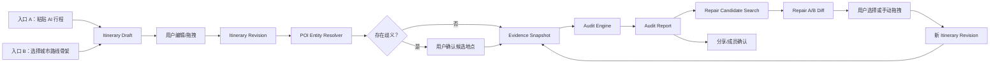
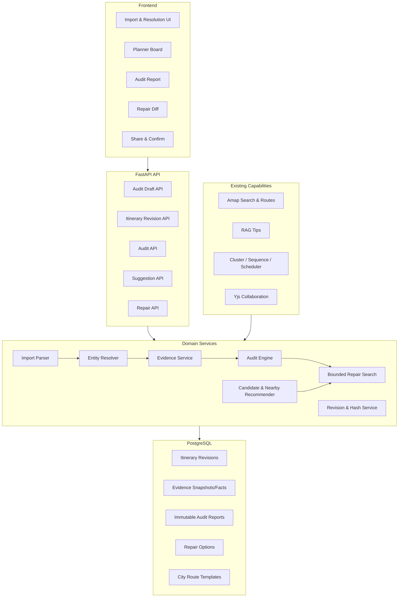

# BreezeTravel 统一产品与架构重构方案

> **状态：已被最终版取代。** 本文保留为方案演进记录，不再作为开发基线。后续实现与验收请以 [《BreezeTravel 双入口可验证行程产品与架构重构最终方案》](../../BreezeTravel_双入口可验证行程产品与架构重构最终方案_2026-08-20.md) 为准。

> 版本：1.0  
> 日期：2026-08-20  
> 状态：开发基线草案  
> 适用仓库：`D:\munto\code\claudeProject\agentTravel`

## 0. 这份文档如何约束开发

本文不是愿景清单，而是 BreezeTravel 下一阶段的产品和架构基线。

文中使用以下约束词：

- **必须**：进入对应版本前必须实现，未完成不能宣称该版本完成；
- **应当**：默认采用，只有记录 ADR 并说明替代方案后才能偏离；
- **不得**：当前阶段明确禁止；
- **以后再做**：不进入当前版本排期，除非前置门禁已经通过。

如果后续代码、接口或产品需求与本文冲突，应先更新本文或新增 ADR，再修改实现。

---

## 1. 最终决策

BreezeTravel 不再把“通用 AI 自动生成旅行攻略”作为主产品，而转型为：

> **把 AI 或用户已有的攻略，变成真的能走、适合同行人、每次修改都有依据的行程。**

技术定位是：

> **Evidence-backed Collaborative Itinerary Verifier, Builder and Repair Engine。**

产品包含两个入口，但只有一条核心链路：

1. **已有行程入口**：粘贴豆包、DeepSeek、ChatGPT 等生成的行程，完成实体消歧、事实取证、风险审计和最小修复；
2. **没有完整行程入口**：从城市路线骨架开始，通过附近推荐和拖拽编辑组合行程，并在每次修改后调用同一个 Audit Engine 检查。

两个入口最终必须收敛到同一种 `ItineraryRevision`。不得为“导入检查”和“拖拽规划”分别维护两套行程结构、规则或修复逻辑。

### 1.1 开发优先级

开发顺序固定为：

```text
R1：行程审计产品
导入 → 实体确认 → 证据快照 → 审计报告 → 修复预览 → 新版本复验

R2：模板化拖拽规划
城市路线骨架 → 附近/顺路推荐 → 拖拽 Patch → 增量审计 → 最终完整审计

R3：成员约束与轻量协同
成员约束 → 冲突解释 → 分享确认 → 版本锁定
```

R1 未通过验收门禁前，不得以拖拽 UI、扩城、更多 Agent 或复杂导入替代核心审计工作。

---

## 2. 产品目标、目标用户与非目标

### 2.1 核心用户

首期用户限定为：

- 20～40 岁的旅行组织者；
- 为 2～5 人朋友或家庭安排国内城市自由行；
- 行程长度 2～5 天；
- 已经有 AI 草稿，或愿意从一个城市路线骨架开始；
- 最担心地点不存在、闭馆、路线走不通、计划太累和同行人不满意。

### 2.2 首期城市

只支持：

- 北京；
- 上海；
- 杭州。

在三城真实审计和真人验证门禁未通过前，不得扩城。

### 2.3 核心用户任务

产品必须帮助用户完成以下任务：

1. 判断 AI 行程中的地点是否真实、是否属于目标城市；
2. 判断营业、时间、路线、天气和成员约束是否冲突；
3. 区分“已确认”“明确冲突”“缺少证据”；
4. 给出保留原计划的局部替换、换日或调时方案；
5. 说明修改影响了什么、照顾了谁、牺牲了什么；
6. 在行程或证据变化后，让旧报告自动失效并生成新报告。

### 2.4 当前非目标

R1/R2 均不得承诺：

- 实时排队和精确客流；
- 全平台最低价格；
- 自动预订或代订；
- 医疗安全判断；
- 全量无障碍设施准确性；
- 所有景区临时政策都能自动获取；
- 自动抓取小红书、抖音等平台的全量内容；
- 任意 PDF、Word、Excel、截图和视频导入；
- 全程实时监控和主动重规划；
- 面向所有旅行 SaaS 的通用 Verifier 平台。

这些能力可以进入以后版本，但不能成为当前架构提前复杂化的理由。

---

## 3. 产品原则与系统不变量

以下原则是代码级不变量。

### 3.1 一个权威行程版本

- 服务端持久化的 `ItineraryRevision` 是唯一权威行程；
- 每次添加、删除、拖动、换日、调时、替换或修复都必须创建新 revision；
- 客户端不得直接覆盖已有 revision；
- `localStorage` 只能作为 UI 缓存，不能决定报告是否有效；
- Yjs 用于同步协作意图和当前 revision 引用，不作为审计报告的唯一持久化来源。

### 3.2 一个权威 Audit Engine

- 所有硬规则和风险状态必须由统一 Audit Engine 输出；
- `critic_v2` 与 `ItineraryVerifier` 不得长期作为两套并行规则源；
- Planner、导入审计、拖拽编辑、修复复验必须调用同一规则注册表；
- LLM 不能直接决定 `SATISFIED` 或 `VIOLATED`。

### 3.3 `UNKNOWN` 不等于通过

验证状态固定为：

```text
SATISFIED / VIOLATED / UNKNOWN
```

风险等级独立为：

```text
BLOCKER / HIGH / MEDIUM / LOW / INFO
```

`UNKNOWN` 可以是高风险，例如无法确认儿童入场、轮椅通行或临时闭馆。任何聚合逻辑不得把 `UNKNOWN` 计入通过率。

### 3.4 每个事实结论都必须可回读

高风险结论必须引用字段级 `EvidenceFact`，包含来源、观测时间、有效期和原始值。仅保存 `poi:{id}` 不足以支撑事实结论。

### 3.5 修复不能静默覆盖

- Repair 只能生成 `RepairOption`；
- 用户应用 Repair 后创建新 revision；
- 修复后必须运行完整审计；
- 不得通过删除违规地点来假装问题已经解决；
- 删除是最后策略，替换、换日和调时优先；
- 锁定项、固定预约、酒店和返程不得被静默移动或删除。

### 3.6 LLM 的职责有边界

LLM 可以：

- 解析非结构化行程文本；
- 提取可能的日期、时间、地点和用户约束；
- 为已计算结论生成易懂说明；
- 为 Repair 搜索生成候选查询词。

LLM 不得：

- 在无来源时断言营业、票价、年龄政策或无障碍条件；
- 代替 POI 实体确认；
- 直接修改权威行程；
- 绕过规则引擎将 UNKNOWN 改成通过；
- 用 LLM Judge 代替真人事实标注。

---

## 4. 统一用户流程



### 4.1 已有行程入口

```text
粘贴原文
→ 显示解析后的每天安排
→ 标出无法确定的地点、日期和时间
→ 用户确认歧义
→ 执行审计
→ 显示必须修、建议调、待确认
→ 预览修复 A/B
→ 应用后重新审计
```

### 4.2 模板拖拽入口

```text
选择城市、天数、人数、预算
→ 选择城市路线骨架
→ 选择第一个锚点
→ 推荐附近、顺路、符合时段的下一站
→ 拖入当天时间轴
→ 仅重算受影响路段和当天风险
→ 选择住宿片区/酒店
→ 完成后运行完整审计
```

模板拖拽入口不是另一个“自动生成 Agent”。它只是生成和修改 `ItineraryRevision` 的一种交互方式。

---

## 5. 目标架构



### 5.1 推荐的目录边界

新增：

```text
backend/app/audit/
├── models.py
├── engine.py
├── severity.py
├── evidence_policy.py
├── report_hash.py
├── repositories.py
└── rules/

backend/app/itineraries/
├── models.py
├── revision_service.py
├── patch_service.py
├── repositories.py
└── diff.py

backend/app/importing/
├── parser.py
├── entity_resolver.py
└── confidence.py

backend/app/suggestions/
├── service.py
├── scoring.py
├── insertion_cost.py
├── hotel_area.py
└── city_templates.py

backend/app/repairs/
├── search.py
├── operations.py
├── objective.py
└── validator.py
```

现有 `backend/app/constraints/` 在迁移期间继续存在，作为 Audit Rules 的来源。不得为了“目录好看”一次性搬迁全部代码；先统一契约和行为，再逐步移动。

---

## 6. 核心数据契约

### 6.1 导入与实体

| 对象 | 必要字段 | 说明 |
|---|---|---|
| `AuditDraft` | `draft_id`, `room_id`, `source_type`, `raw_text`, `parse_version`, `status` | 保存原始输入，不覆盖 |
| `RawStop` | `raw_stop_id`, `day_index`, `raw_name`, `raw_time`, `source_span`, `source_sentence` | 任何解析结果都能回到原文 |
| `ResolvedStop` | `raw_stop_id`, `canonical_place_id`, `candidates`, `confidence`, `resolution_status`, `confirmed_by` | 低置信度不得静默匹配 |

`resolution_status` 固定为：

```text
AUTO_MATCHED / USER_CONFIRMED / AMBIGUOUS / NOT_FOUND
```

### 6.2 行程版本

`ItineraryRevision` 必须包含：

```text
itinerary_id
revision
parent_revision
room_id
city
date_range
days[].slots[]
locked_commitments[]
created_by
created_at
change_reason
content_hash
```

每个 slot 至少包含：

```text
slot_id
place_id
day_index
order_index
start_time
end_time
visit_duration_minutes
transport_to_next
locked
source_raw_stop_id
```

不得再仅凭递增的 `itinerary.version` 判断内容变化；`content_hash` 必须覆盖天、顺序、时间、地点、锁定状态和交通方式。

### 6.3 成员与约束

当前 `Travelers` 计数继续保留作为兼容字段，新增：

```text
TravelerProfile
  member_id
  display_name
  age_group
  mobility_profile
  dietary_restrictions
  confirmed_revision

MemberConstraint
  constraint_id
  owner_member_id
  constraint_type
  hardness
  value
  scope
  confirmed
  waivable_by
  revision
```

`hardness` 固定为：

```text
HARD / SOFT
```

投票不得覆盖任意成员的 HARD 约束。HARD 约束只能由该成员或被明确授权的组织者放弃，并保留审计记录。

### 6.4 证据

`EvidenceFact` 必须包含：

```text
fact_id
snapshot_id
entity_id
fact_type
value_json
provider
source_url
observed_at
valid_from
valid_until
response_hash
confidence
freshness_status
```

`freshness_status` 固定为：

```text
FRESH / STALE / UNAVAILABLE / CONFLICTING
```

### 6.5 审计结果

`AuditFinding` 必须包含：

```text
finding_id
rule_id
rule_version
status
severity
reason_code
message
day_index
slot_ids
affected_member_ids
evidence_fact_ids
repairable
```

`AuditReport` 必须包含：

```text
report_id
itinerary_id
itinerary_revision
task_id
task_revision
member_constraint_revision_set
evidence_snapshot_id
report_input_hash
overall_status
findings
created_at
supersedes_report_id
```

报告是不可变历史记录。刷新证据或修改行程只能创建新报告，不得覆盖旧报告。

### 6.6 修复

`RepairOption` 必须包含：

```text
repair_id
base_itinerary_revision
patches[]
edit_cost
risk_cost
travel_cost
tradeoffs[]
affected_member_ids[]
result_preview
post_audit_report_id
status
```

`status` 固定为：

```text
PROPOSED / APPLIED / REJECTED / STALE
```

---

## 7. 服务端版本、哈希和持久化

### 7.1 新报告哈希

`report_input_hash` 必须由服务端生成：

```text
SHA256(
  task_id + task_revision
  + sorted(member_constraint_id + revision)
  + itinerary_id + itinerary_revision + itinerary_content_hash
  + sorted(resolved_place_id + resolution_version)
  + evidence_snapshot_id
  + audit_rule_set_version
)
```

以下任意变化都必须使旧报告失效：

- 地点顺序变化；
- 地点换日；
- 开始/结束时间变化；
- 添加或删除地点；
- 锁定状态变化；
- 成员硬约束变化；
- POI 消歧结果变化；
- 证据快照变化；
- 规则集版本变化。

### 7.2 数据库迁移

新增 `009_audit_domain.sql`，建议包含：

```text
audit_drafts
itinerary_revisions
traveler_profiles
member_constraints
evidence_snapshots
evidence_facts
audit_reports
repair_options
city_route_templates
```

迁移原则：

- 现有 `verification_reports` 保留为 legacy，不直接删除；
- 新报告写入 `audit_reports`；
- 旧 `/api/optimize` 在兼容期仍可返回 legacy 字段；
- 完成新前端切换和回归后，再通过 ADR 决定是否下线 legacy 表和字段；
- 所有表必须有 `room_id` 所属关系和必要索引；
- 报告、revision、evidence snapshot 采用 append-only，禁止 `UPDATE` 覆盖内容字段。

### 7.3 并发控制

所有编辑和 Repair apply 必须带：

```http
If-Match: <base-itinerary-revision>
Idempotency-Key: <client-generated-key>
```

服务端发现 revision 不一致时返回：

```http
409 ITINERARY_REVISION_CONFLICT
```

不得在冲突时静默覆盖其他成员修改。

---

## 8. Evidence Service

### 8.1 来源优先级

第一期来源优先级：

```text
1. 用户提供的预订/票务事实
2. 景区、场馆、交通运营方官方页面或接口
3. 高德 POI、路线和天气结构化数据
4. 有来源 URL 和时间的公开旅游资料
5. RAG 游记，仅用于体验建议，不用于高风险事实证明
```

来源冲突时不得自动选择对用户更乐观的结果，应生成 `CONFLICTING` EvidenceFact 和 `UNKNOWN/HIGH` finding。

### 8.2 初始新鲜度策略

以下是第一版工程策略，不代表现实信息永久有效：

| 事实类型 | 初始有效策略 |
|---|---|
| POI 名称、城市、坐标 | 7 天；出现冲突立即失效 |
| 常规营业时间 | 72 小时；临行前 24～48 小时复检 |
| 临时闭馆、预约政策 | 24 小时或采用来源给出的 `valid_until` |
| 路线时间 | 报告生成时有效；拖拽后立即重算受影响路段 |
| 天气 | 仅在提供方预报范围内使用；6 小时后刷新 |
| 价格 | 只标“参考”；不作为实时成交价承诺 |
| 年龄、身高、无障碍政策 | 优先官方来源；无可靠来源为 UNKNOWN |

TTL 必须配置化并写入 `evidence_policy.py`，不得散落在规则代码中。

### 8.3 失败行为

- 高德或天气接口失败：保留其他成功证据，对相应字段输出 UNKNOWN；
- 官方页面无法访问：不得用 LLM 常识补齐；
- 查询无结果：区分 `NOT_FOUND` 与 `PROVIDER_UNAVAILABLE`；
- 部分证据失败：不得丢弃整份报告，必须展示降级范围。

---

## 9. Audit Engine 与规则分层

### 9.1 规则分层

#### L0：输入完整性

- 城市、日期、天数是否存在；
- 日期、时间是否可解析；
- 地点是否存在歧义；
- 固定预约是否提供时间；
- 人数和成员信息是否足够执行目标规则。

#### L1：事实核验

- 地点是否存在；
- 是否在目标城市；
- POI 类型是否合理；
- 营业时间、闭馆日和最晚入场；
- 预约、年龄/身高和天气政策；
- 证据是否缺失、过期或冲突。

#### L2：时空可行性

- 时间重叠；
- 游览时长是否明显不足；
- 地点间交通时间是否足够；
- 是否跨区折返；
- 是否按约定返回酒店；
- 是否能赶上固定返程。

#### L3：成员适配

- 连续活动时长；
- 午餐、晚餐和休息缺口；
- 步行距离、换乘次数和连续活动代理指标；
- 老人、儿童、饮食和固定时间约束。

不得把“低步行代理指标”宣传成精确体力或医疗安全评估。

#### L4：群体冲突

- 哪位成员的硬约束被违反；
- 必须项是否互相冲突；
- 修复方案要求谁妥协；
- 是否可以通过分组解决；
- 关键成员是否仍未确认。

### 9.2 合并 `critic_v2` 与 Verifier

现有规则迁移映射：

| `critic_v2` 规则 | 统一后的规则 |
|---|---|
| `R_OPEN_HOURS` | `OpeningScheduleRule` |
| `R_MEAL_SLOT_FILLED` / `R_ZERO_FOOD_DAY` | `MealWindowRule` |
| `R_BUFFER_DEFICIT` | `TimeChainRule` + `TravelTimeRule` |
| `R_WEATHER_MISMATCH` | `WeatherActivityRule` |
| `R_DAILY_HOTEL_END` | `DailyHotelRule` |
| `R_DAILY_FOOD_CAP` | `MealDensityRule`，建议级别 |
| `R_NO_BACKTOBACK_L2` | `CategoryDiversityRule`，建议级别 |

迁移完成后：

- `critic_v2` 不再出现在主 PlannerGraph；
- `critic_violations` 标记为 deprecated；
- `tips` 在最终 revision 和审计完成后生成；
- Repair 后必须重新审计，再为最终结果生成 Tips；
- 规则输出统一为 `AuditFinding`。

### 9.3 新 PlannerGraph

兼容生成入口的目标流程：

```text
clusterer
→ distance
→ sequencer
→ weather_fetcher
→ scheduler
→ persist draft revision
→ Audit Engine
→ generate repair options（不静默应用）
→ tips for selected/final revision
```

Audit Engine 必须可以脱离 PlannerGraph 独立运行。

---

## 10. 修复算法

### 10.1 词典序目标

Repair 按以下顺序优化：

```text
1. 不破坏锁定项、固定预约、酒店和返程
2. 消除 BLOCKER 与 HARD 约束违规
3. 不把已验证事实退化为新的 UNKNOWN
4. 最小化编辑数量
5. 最小化时间偏移和换日数量
6. 保留高优先级与多数成员认可地点
7. 最小化新增交通和体力成本
8. 返回两个取舍明显不同的方案
```

### 10.2 第一版允许的局部操作

```text
ADJUST_TIME
MOVE_WITHIN_DAY
MOVE_TO_DAY
REPLACE_STOP
ADD_MEAL_OR_REST
REMOVE_STOP
SPLIT_GROUP（R3 才启用）
```

### 10.3 搜索流程

第一期不得直接引入复杂通用求解器。采用有界局部搜索：

1. 从 BLOCKER/HIGH finding 生成可用操作；
2. 为替换和移动获取小规模候选；
3. 为每个候选创建临时 revision；
4. 运行完整 Audit Engine；
5. 丢弃新增 HARD 违规或破坏锁定项的候选；
6. 计算 `edit_cost + risk_cost + travel_cost`；
7. 去除高度相似方案；
8. 返回最多 2 个方案。

`TargetedRepairController` 在过渡期保留为 legacy/fallback，不直接作为新产品 Repair Service。

### 10.4 非回归要求

每个 `RepairOption` 都必须显示：

- 修复了哪些 finding；
- 保留了哪些锁定项；
- 新增了哪些 UNKNOWN；
- 路程和时间变化；
- 影响哪些成员；
- 修复后报告 ID。

若无法找到不引入新硬违规的方案，应返回“没有可靠自动修复”，不得返回看似完整但未通过复验的方案。

---

## 11. 城市模板与拖拽规划

### 11.1 定位

城市模板不是写死的最终行程，而是：

```text
城市游玩片区
+ 一天的节奏槽位
+ 少量稳定锚点
+ 可替换地点组
+ 住宿片区建议
```

每个城市 R2 只做 5～8 条路线骨架：

- 第一次到访经典路线；
- 历史文化路线；
- 亲子室内路线；
- 低体力轻松路线；
- 城市漫步路线；
- 雨天替代路线。

### 11.2 `CityRouteTemplate`

```text
template_id
template_version
city
name
suitable_days
suitable_group_tags
budget_band
intensity
day_zones[]
anchor_slots[]
alternative_groups[]
hotel_areas[]
source_refs[]
last_verified_at
status
```

模板可以保存稳定景点锚点，但不得永久写死易关闭的餐馆和具体酒店。餐饮和酒店应在使用时通过实时 POI 候选填充。

### 11.3 附近推荐不是画圆

候选插入当前日程的额外成本：

```text
insertion_minutes =
  route(previous, candidate)
  + route(candidate, next)
  - route(previous, next)
```

只有末尾锚点时：

```text
insertion_minutes = route(previous, candidate)
```

排序采用硬过滤后加权：

```text
candidate_score =
  evidence_score
  + slot_fit_score
  + preference_score
  + diversity_score
  - insertion_minutes_cost
  - budget_penalty
  - uncertainty_penalty
```

硬过滤包括：

- 城市与区域；
- 明确闭馆；
- 明确年龄/身高不符；
- 与固定时间冲突；
- HARD 成员约束；
- 明确超出预算硬上限。

候选解释分为：

| 类型 | 行为 |
|---|---|
| `ON_ROUTE` | 默认推荐，额外通勤较小 |
| `ACCEPTABLE_DETOUR` | 展示额外代价 |
| `DEFER_TO_OTHER_DAY` | 不放入当前推荐前列，建议另一天/片区 |
| `INFEASIBLE` | 显示不可安排原因，不允许直接作为安全推荐 |

远处的地点不得简单消失。它应进入“更适合另一天”的候选，避免把地理过滤误解为地点质量判断。

### 11.4 酒店策略

用户未选择足够景点时，只推荐住宿片区，不急于推荐具体酒店。

达到至少两个游玩片区或三个锚点后，酒店评分考虑：

```text
各天首站通勤
+ 各天末站返程
+ 地铁/交通便利性
+ 入住人数与房间约束
+ 连住要求
+ 预算
+ 证据完整度
```

酒店不得仅按离第一个景点最近排序。

### 11.5 拖拽交互

桌面端使用三栏：

```text
地图 | 每日时间轴 | 附近推荐/风险/替代
```

拖动前显示预览：

- 预计增加的通勤；
- 预计到达和结束时间；
- 会触发的硬冲突；
- 更适合的日期；
- 可替换地点。

拖动落下后：

1. 发送结构化 Patch；
2. 服务端创建新 revision；
3. 重算受影响的相邻路段；
4. 对受影响日期运行增量审计；
5. 最终确认前运行完整审计。

移动端必须同时提供“加入某天、上移、下移、换日、替换、锁定、删除”按钮，不得把所有操作只绑定在拖拽手势上。

### 11.6 协同边界

R2 首期只允许组织者编辑，其他成员查看、评论和确认。多人同时拖拽排序延后到 R3，避免 CRDT 顺序与服务端 revision 并发控制同时成为首期阻塞点。

R3 中 Yjs 只广播：

```text
current_itinerary_revision
current_audit_report_id
member_confirmation_state
pending_patch_intents
```

服务端 revision 仍是权威来源。

---

## 12. API 设计

### 12.1 R1：导入与审计

```http
POST /api/audit-drafts
```

输入原文，返回结构化草稿、字段置信度和歧义地点。

```http
PATCH /api/audit-drafts/{draft_id}/resolutions
```

确认 POI、日期和时间歧义。

```http
POST /api/itineraries
Idempotency-Key: ...
```

从已确认草稿创建 revision 1。

```http
POST /api/audits
Idempotency-Key: ...
```

基于指定 revision 创建 Evidence Snapshot 和 Audit Report。

```http
GET /api/audits/{audit_id}
GET /api/audits/{audit_id}/events
```

读取报告或通过 SSE 获取解析、取证和审计进度。

```http
POST /api/audits/{audit_id}/repairs
```

生成最多两个 RepairOption，不覆盖原行程。

```http
POST /api/audits/{audit_id}/repairs/{repair_id}/apply
If-Match: <revision>
Idempotency-Key: ...
```

应用 Repair，创建新 revision 并生成新报告。

```http
POST /api/audits/{audit_id}/refresh
```

创建新证据快照和新报告，并返回报告差异。

### 12.2 R2：模板与拖拽

```http
GET /api/cities/{city}/route-templates
GET /api/cities/{city}/route-templates/{template_id}
```

返回受支持且版本化的路线骨架。

```http
GET /api/itineraries/{itinerary_id}/revisions/{revision}/suggestions
  ?day_index=0
  &previous_slot_id=...
  &next_slot_id=...
  &slot_type=attraction
```

返回 `ON_ROUTE / ACCEPTABLE_DETOUR / DEFER_TO_OTHER_DAY / INFEASIBLE` 候选和解释。

```http
POST /api/itineraries/{itinerary_id}/patches
If-Match: <revision>
Idempotency-Key: ...
```

支持：

```text
MOVE_STOP
MOVE_TO_DAY
ADJUST_TIME
ADD_STOP
REPLACE_STOP
REMOVE_STOP
LOCK_STOP
UNLOCK_STOP
```

返回新 revision、受影响路段和增量审计摘要。

### 12.3 错误码

至少稳定定义：

```text
DRAFT_AMBIGUOUS
PLACE_NOT_FOUND
EVIDENCE_PROVIDER_UNAVAILABLE
AUDIT_INPUT_STALE
ITINERARY_REVISION_CONFLICT
PATCH_BREAKS_LOCKED_COMMITMENT
REPAIR_NO_FEASIBLE_OPTION
CITY_NOT_SUPPORTED
TEMPLATE_VERSION_STALE
```

---

## 13. 现有代码修改清单

| 当前文件/模块 | 修改方向 | 阶段 |
|---|---|---|
| `backend/app/services/planning_hash.py` | 新增覆盖完整行程顺序、时间、锁定项、证据和规则版本的服务端哈希；旧函数保留兼容 | P1 |
| `backend/app/db/migrations/008_task_security_memory.sql` | 不直接修改历史迁移；新增 `009_audit_domain.sql` | P1 |
| `backend/app/schemas/itinerary.py` | 保持 legacy schema；在 `app/itineraries/models.py` 新增 revision/slot 契约和转换器 | P1 |
| `backend/app/schemas/verification.py` | 保持 legacy response；新增 `AuditFinding/AuditReport`，逐步替换 | P1/P2 |
| `backend/app/schemas/task_spec.py` | 增加受控 constraint type、成员约束引用；保留 Travelers 计数兼容 | P1 |
| `backend/app/constraints/registry.py` | 成为唯一规则注册入口，加入规则版本和分层 | P2 |
| `backend/app/constraints/verifier.py` | 改为 Audit Engine adapter，或逐步由 `audit/engine.py` 替代 | P2 |
| `backend/app/agents/planner/nodes/critic_v2.py` | 先做规则 parity 测试，再从主图移除；不直接删除测试覆盖 | P2 |
| `backend/app/agents/planner/graph.py` | 调整为 scheduler → persist revision → audit；Repair 只生成选项；Tips 放到最终 revision 后 | P2/P4 |
| `backend/app/agents/planner/repair_controller.py` | 标为 legacy；新修复进入 `app/repairs/` | P4 |
| `backend/app/agents/editor/fast_path.py` | 不再直接修改传入 JSON；统一调用 Revision Patch Service | P1/P6 |
| `backend/app/api/edit.py` | 兼容期保留；新增 revision-aware Patch API，最终 deprecated | P1/P6 |
| `backend/app/api/optimize.py` | 保留旧生成入口；响应增加 canonical revision/report 引用 | P2 |
| `backend/app/main.py` | 注册 audits、itineraries、suggestions、route_templates routers | P1/P5 |
| `backend/app/constraints/candidate_selection.py` | 抽取可复用候选过滤和证据评分；不直接承担交互式插入排序 | P5 |
| `backend/app/constraints/geo_routes.py` | 复用路线取证，增加 insertion cost 批量接口和缓存键 | P5 |
| `backend/app/agents/planner/templates.py` | 保留节奏模板；新增城市路线骨架层，不混为同一概念 | P5 |
| `frontend/src/hooks/useOptimize.ts` | 停止把 localStorage 报告作为权威；读取 server revision/report | P3 |
| `frontend/src/hooks/useYjsRoom.ts` | 增加 revision/report/confirmation 引用；R3 才做多人排序意图 | P7 |
| `frontend/src/components/itinerary/ConstraintPanel.tsx` | 替换为风险分组、证据、影响成员和修复入口 | P3 |
| `frontend/src/components/places/PlaceList.tsx` | R2 增加 Planner Board/Suggestion Drawer，不在旧列表中硬塞全部交互 | P6 |
| `frontend/package.json` | R2 引入 `@dnd-kit/core` 与 `@dnd-kit/sortable` | P6 |

### 13.1 不允许的修改方式

- 不得直接删除旧 `/api/optimize`、`Itinerary` 或现有前端路线；
- 不得一次性把全部 `constraints` 文件搬到新目录；
- 不得同时重写 Router、RAG、Planner、Yjs 和 Audit；
- 不得用前端计算结果代替服务端 revision 和报告；
- 不得为新架构引入微服务、MQ、Kubernetes 或新数据库。

---

## 14. 分阶段实施计划

### P0：产品与架构基线冻结（3～5 天）

交付：

- 本文档进入仓库；
- 一份转型 ADR；
- 10 份真实 AI 行程及人工排雷记录；
- 旧能力冻结清单；
- 新旧接口兼容策略。

门禁：

- 真实样本中存在重复出现的地点错配、营业、路线、节奏或成员问题；
- 团队能用一句话区分“生成器”和“审计器”。

### P1：Revision、哈希和持久化（5～8 天）

交付：

- `009_audit_domain.sql`；
- `ItineraryRevision` 和 Patch Service；
- 服务端 `report_input_hash`；
- 不可变 AuditReport repository；
- `If-Match` 和幂等键。

门禁：

- 任意顺序、时间或地点修改都会创建新 revision；
- 旧报告自动显示 stale；
- 跨浏览器读取结果一致；
- 并发旧 revision 写入返回 409。

### P2：统一 Audit Engine（7～10 天）

交付：

- Audit contracts；
- 规则分层和版本；
- `critic_v2`/Verifier parity 测试；
- Planner 改用统一 Audit Engine；
- 字段级 EvidenceFact adapter。

门禁：

- 主流程只有一套权威 finding；
- UNKNOWN 误判为 SATISFIED 为 0；
- 所有 HIGH/BLOCKER finding 有证据或明确的证据缺失原因；
- Planner 旧回归测试通过。

### P3：文本导入与实体消歧（7～10 天）

交付：

- 纯文本导入；
- 原文 span 映射；
- 高德 POI 候选；
- 地点歧义确认 UI；
- 创建 revision 1。

门禁：

- 高置信度自动匹配精确率达到评测门槛；
- 静默错配数为 0；
- 低置信度地点必须进入确认步骤；
- 不支持的日期/格式明确报错或要求确认。

### P4：风险报告与最小修复（7～12 天）

交付：

- 必须修/建议调/待确认报告；
- EvidenceFact 展示；
- Repair A/B；
- diff、tradeoff 和复验报告；
- 无可靠方案时的显式失败。

门禁：

- 锁定项破坏率为 0；
- 修复后新增硬违规数为 0；
- Repair 后完整复验率 100%；
- 删除不是营业/交通冲突的默认第一方案。

### R1 Beta：审计产品真人验证（7～10 天）

交付：

- 30 份真实行程；
- 15～20 名组织者反馈；
- 问题采纳和误报记录；
- 公开可复现的本地/测试证据。

门禁见第 15 节。未通过不得宣称“行程排雷产品已经有效”。

### P5：城市路线骨架与建议服务（7～10 天）

前置条件：R1 的问题认可率和报告完成率达到门槛。

交付：

- 三城各 5～8 条路线骨架；
- 模板版本和来源；
- insertion cost；
- 顺路/绕行/另一天/不可行四类候选；
- 酒店片区评分。

门禁：

- 明确远距离候选不会伪装成顺路；
- 候选解释包含额外通勤和约束结果；
- 易关闭餐馆/酒店不被永久写死在模板中。

### P6：拖拽式 Planner Board（7～12 天）

交付：

- 桌面拖拽；
- 移动端按钮操作；
- Patch API；
- 受影响路段重算；
- 增量审计和最终完整审计；
- Undo/Redo 通过 revision 实现。

门禁：

- 每次落下生成唯一 revision；
- 旧报告立即失效；
- 拖动不触发 LLM；
- 最终报告与完整 Audit Engine 一致；
- 50 次连续编辑无 revision 丢失或静默覆盖。

### P7：成员约束与分享确认（5～8 天）

交付：

- 成员级 HARD/SOFT 约束；
- 分享查看和轻量确认；
- 影响成员与妥协说明；
- Yjs revision/report 引用同步。

门禁：

- 投票不能覆盖 HARD 约束；
- 未确认成员不能被显示为已同意；
- 并发 revision 冲突可见且可恢复。

### 总周期

单人开发的现实估计：

- R1 可用审计 MVP：约 6～8 周；
- R2 模板与拖拽：追加约 4～6 周；
- R3 成员协同和公开 Beta 收尾：追加约 2～4 周；
- 完整统一方向：约 12～16 周。

若目标只有两个月，必须以 R1 为完成边界，R2 只做一个城市、一个模板的交互原型，不得把三城拖拽产品宣称为已完成。

---

## 15. 评测与发布门禁

### 15.1 新 Auditor 数据集

建立 150 份三城数据集：

- 60 份真实 AI 原始行程；
- 60 份基于真实行程的受控变异；
- 30 份歧义、极端和 UNKNOWN 边界案例。

北京、上海、杭州各 50 份。按原始行程分割训练/调试/盲测，同一原始行程的变体不得跨集合。

现有 150 条推荐评测保留为旧产品回归，不能作为 Auditor 有效性的证据。

### 15.2 技术指标

| 层级 | 指标 | R1 门槛 |
|---|---|---:|
| 解析 | 日期、时间、地点、固定预约字段 F1 | ≥ 0.90 |
| 实体 | 高置信度 POI 自动匹配 precision | ≥ 0.95 |
| 实体 | 静默错配 | 0 |
| 审计 | BLOCKER/HIGH precision | ≥ 0.90 |
| 审计 | BLOCKER/HIGH recall | ≥ 0.85 |
| 审计 | UNKNOWN → SATISFIED 错误 | 0 |
| 审计 | HIGH/BLOCKER 证据可回读率 | 100% |
| 修复 | 锁定项破坏率 | 0 |
| 修复 | 修复后新增硬违规 | 0 |
| 修复 | 修复后完整复验率 | 100% |
| 性能 | 80% 报告完成时间 | ≤ 3 分钟 |

### 15.3 产品指标

内部继续投入门槛：

- 70% 以上真实行程发现至少一个用户认可的非显然问题；
- 关键错误人工核对准确率达到 85% 以上；
- 50% 以上组织者愿意分享报告或在下一次旅行复用；
- Repair 方案有稳定的应用率，并记录拒绝原因；
- 至少出现真实的小额付费或明确的 B 端使用意向，不能只记录“口头愿意付费”。

### 15.4 R2 拖拽指标

- 从模板到第一个可审计行程的中位时间；
- 推荐地点加入率；
- `DEFER_TO_OTHER_DAY` 解释的接受率；
- 每次拖动后的 revision 成功率；
- 增量审计与完整审计一致率；
- 用户手动撤销率和撤销原因；
- 酒店片区推荐后再次大幅换区的比例。

### 15.5 证据边界

发布说明必须分开：

```text
单元测试
本地集成测试
快照回放
真实高德/天气链路
真人事实标注
真实用户验证
公网可用性
付费或商业证据
```

任何一项未完成都不得用其他项代替。

---

## 16. 前端页面与状态边界

### R1 页面

```text
/audit/new                 粘贴和解析
/audit/{draft_id}/resolve  实体、日期和时间确认
/audit/{audit_id}          风险报告
/audit/{audit_id}/repairs  Repair A/B diff
```

### R2 页面

```text
/plan/new                  城市、天数、人数、预算、模板
/plan/{itinerary_id}       地图 + 时间轴 + 推荐抽屉
```

### 状态归属

| 状态 | 权威来源 |
|---|---|
| 行程 revision | PostgreSQL / Revision API |
| Audit Report | PostgreSQL / Audit API |
| Evidence Snapshot | PostgreSQL / Evidence Service |
| 当前拖拽预览 | 前端本地 UI state |
| 当前选中、悬停和抽屉 | Zustand |
| 协同 presence、确认状态 | Yjs + 服务端 revision 引用 |
| localStorage | 仅缓存，不参与权威判断 |

---

## 17. 测试策略

### 17.1 必须新增的测试层

```text
backend/tests/audit/
  test_report_hash.py
  test_revision_repository.py
  test_entity_resolution.py
  test_evidence_freshness.py
  test_rule_layers.py
  test_unknown_boundary.py
  test_repair_non_regression.py
  test_revision_conflicts.py

backend/tests/suggestions/
  test_insertion_cost.py
  test_far_place_deferral.py
  test_hotel_area_scoring.py
  test_template_versioning.py

frontend/e2e/
  audit-import.spec.ts
  audit-resolution.spec.ts
  repair-diff.spec.ts
  planner-drag.spec.ts
  revision-conflict.spec.ts
```

### 17.2 关键回归

- 现有 Planner、Router、RAG、Yjs、鉴权测试继续运行；
- `critic_v2` 移除前必须有规则 parity 测试；
- legacy `/api/optimize` 在兼容期必须有契约测试；
- 新旧 `Itinerary` 转换必须有 round-trip 测试；
- Evidence Provider 故障必须覆盖 timeout、empty、429、5xx 和 partial success；
- 修复搜索必须覆盖没有可行解的显式失败。

---

## 18. 风险与对应措施

| 风险 | 影响 | 对策 |
|---|---|---|
| POI 同名或地点错配 | 产生错误事实链 | 高精度优先；低置信度用户确认；静默错配为 0 |
| 营业和政策数据不完整 | 报告误导 | EvidenceFact、TTL、UNKNOWN、临行复检 |
| 规则误报过多 | 用户不信任 | 严重度分层、真实行程误报单独统计、支持用户反馈 |
| Repair 通过删除来消除错误 | 方案价值低 | 词典序目标、删除最后、完整复验 |
| 拖拽导致频繁全图重算 | 延迟和成本高 | 结构化 Patch、局部路段重算、拖动不调用 LLM |
| Yjs 与服务端 revision 冲突 | 多人覆盖 | R2 单编辑者；R3 If-Match、冲突可见、服务端权威 |
| 同时做审计与拖拽导致失焦 | 两套半成品 | R1 门禁通过后才启动 R2 |
| 模板长期过期 | 推荐关闭地点 | 模板版本、来源、锚点与实时候选分离 |
| 付费意愿不足 | C 端难商业化 | 单次付费/临行复检试验；稳定规则再考虑 B2B API |

---

## 19. 立即停止或推迟的工作

在 R1/R2 门禁通过前停止：

- 新增更多 Agent；
- 扩展到更多城市；
- GraphRAG；
- Kubernetes；
- MQ 或复杂微服务；
- 新一轮 LoRA 微调；
- 任意文档/视频导入；
- 自动抓取所有官方页面；
- 实时排队、最低价和自动预订；
- 通用 B2B Verifier API；
- 用模型共识代替真人事实校准；
- 为展示“多 Agent”而拆分没有独立状态和失败边界的节点。

现有 Router、RAG、MCP、Memory、Planner、Yjs 只做必要维护和回归，不继续横向堆功能。

---

## 20. 完成定义

### R1 完成

只有同时满足以下条件，才能称为“行程排雷 MVP 完成”：

- 用户能粘贴纯文本 AI 行程；
- 所有低置信度地点都要求确认；
- 报告由服务端持久化并绑定 revision 和 evidence snapshot；
- 报告展示 SATISFIED/VIOLATED/UNKNOWN 和风险等级；
- HIGH/BLOCKER 有可回读证据或明确缺失原因；
- Repair 不覆盖原行程，应用后创建新 revision；
- 修复后完整复验；
- 技术指标门禁通过；
- 已完成真实用户小样本验证，并明确仍未通过的项目。

### R2 完成

只有同时满足以下条件，才能称为“拖拽规划 MVP 完成”：

- 用户能从城市路线骨架开始；
- 地点推荐能解释顺路、绕行、另一天和不可行；
- 酒店先按片区、后按全行程评分；
- 拖拽产生服务端 revision；
- 拖拽后只重算受影响路段和当天检查；
- 最终确认前运行完整 Audit Engine；
- 移动端不依赖拖拽手势；
- 三城模板和候选证据有版本与来源；
- 拖拽评测门禁通过。

### R3 完成

- 成员级 HARD/SOFT 约束可表达；
- 投票不能覆盖 HARD 约束；
- 谁受影响、谁妥协可解释；
- 未确认成员不显示为已同意；
- 多人 revision 冲突不会静默覆盖。

---

## 21. 最终产品表达

第一屏用户文案：

> **把 AI 生成的攻略，变成真的能走的行程。**

已有行程入口：

> **粘贴豆包、DeepSeek 或 ChatGPT 行程，检查地点、营业、路线、天气和同行人限制，并获得有依据的替换方案。**

模板拖拽入口：

> **从城市经典路线开始，像搭积木一样选择和拖动地点；每次调整，系统都会告诉你是否顺路、是否开放、是否适合同行人。**

内部技术表达：

```text
非结构化输入 / 城市路线骨架
→ 统一行程版本
→ 实体消歧
→ 字段级证据快照
→ 确定性审计
→ 有界修复搜索
→ 非回归复验
→ 成员确认
→ 版本化报告
```

这条链路是下一阶段 BreezeTravel 的开发主线。任何新功能都必须说明它服务于链路中的哪一步、解决了哪个已观察 bad case、由什么指标证明有效；无法回答这三个问题的功能不进入当前排期。
